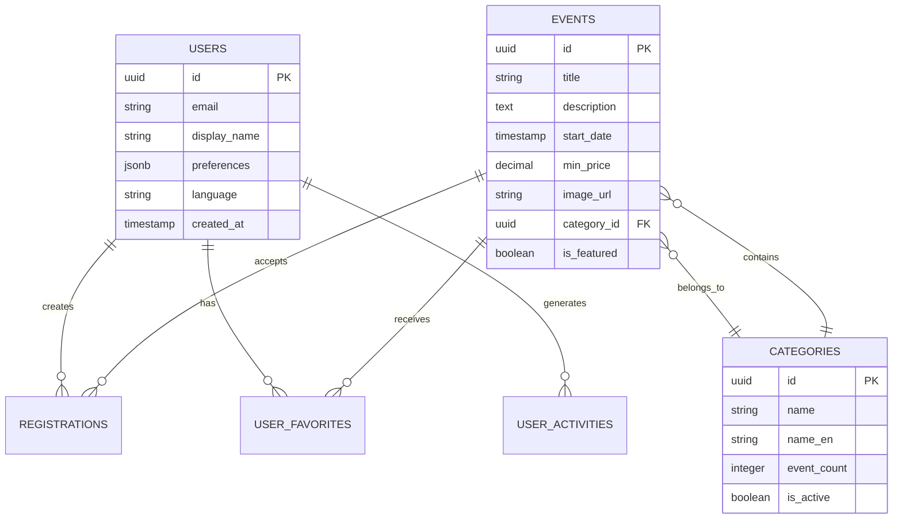
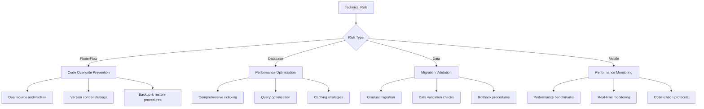
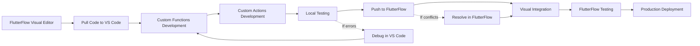

# FlutterFlow Event Platform: Brownfield Architecture Document

> **Project Type:** Brownfield Integration  
> **Architecture Version:** 1.0  
> **Created Date:** 2025-01-15  
> **Architect:** Winston (System Architect)  
> **Technical Lead:** Claude Code  

---

## 🚀 架構文檔已模組化

此完整架構文檔已分片為多個專門的模組，便於深入研讀和實施：

### 📚 分片文檔導航

1. **[執行摘要和系統概述](architecture/01-executive-summary.md)**
   - 專案背景和目標
   - Brownfield 整合策略
   - 核心架構原則

2. **[資料庫架構設計](architecture/02-database-architecture.md)**
   - Supabase 資料庫設計
   - 實體關係模型
   - 搜尋索引和效能最佳化

3. **[FlutterFlow 整合模式](architecture/03-flutterflow-integration.md)**
   - Custom Functions 架構
   - 資料來源整合模式
   - 元件參數最佳化

4. **[搜尋與效能最佳化](architecture/04-search-performance.md)**
   - 全文搜尋實作
   - 行動裝置效能最佳化
   - 快取和分頁策略

5. **[移轉策略和風險管理](architecture/05-migration-strategy.md)**
   - 階段性實施計劃
   - 風險評估和緩解策略
   - 測試和回滾程序

6. **[實施指南和最佳實踐](architecture/06-implementation-guidelines.md)**
   - 開發工作流程
   - 程式碼組織標準
   - 品質保證和部署策略

7. **[效能監控和成功指標](architecture/07-monitoring-metrics.md)**
   - 關鍵效能指標 (KPI)
   - 即時監控儀表板
   - 自動警報和成功驗證

### 📖 使用指南

- **架構師和技術主管：** 建議從 [執行摘要](architecture/01-executive-summary.md) 開始，然後深入相關專業領域
- **開發團隊：** 重點關注 [FlutterFlow 整合模式](architecture/03-flutterflow-integration.md) 和 [實施指南](architecture/06-implementation-guidelines.md)
- **專案經理：** 關注 [移轉策略](architecture/05-migration-strategy.md) 和 [監控指標](architecture/07-monitoring-metrics.md)

---

## 📋 原始完整目錄

- [1. Executive Summary](#1-executive-summary)
- [2. Current System Analysis](#2-current-system-analysis)
- [3. Brownfield Integration Strategy](#3-brownfield-integration-strategy)
- [4. Database Architecture](#4-database-architecture)
- [5. FlutterFlow Integration Patterns](#5-flutterflow-integration-patterns)
- [6. Search & Performance Optimization](#6-search--performance-optimization)
- [7. Migration Roadmap](#7-migration-roadmap)
- [8. Risk Assessment & Mitigation](#8-risk-assessment--mitigation)
- [9. Implementation Guidelines](#9-implementation-guidelines)
- [10. Success Metrics & Monitoring](#10-success-metrics--monitoring)

---

## 1. Executive Summary

### 1.1 Project Context

This architecture document addresses the **brownfield integration** of a FlutterFlow-based event platform with a Supabase backend, transitioning from mock data (FFAppState) to production-ready real-time data architecture while preserving the complete existing UI/UX investment.

### 1.2 Architectural Principles

**🎯 Zero UI Disruption:** Maintain 100% existing FlutterFlow UI components and user flows  
**🔄 Gradual Migration:** Implement progressive data source migration with fallback mechanisms  
**⚡ Performance First:** Optimize for mobile app performance and Supabase query efficiency  
**🌐 Internationalization Ready:** Support English and Traditional Chinese from day one  
**🔐 Security Compliance:** Implement robust authentication and data protection patterns  

### 1.3 Key Integration Challenges

| Challenge | FlutterFlow Constraint | Solution Strategy |
|-----------|----------------------|-------------------|
| **Data Source Migration** | Cannot modify page widget files directly | Use Custom Functions for data transformation |
| **Mixed Data Patterns** | FFAppState vs Supabase queries | Implement progressive migration with dual-source support |
| **Search Functionality** | Limited complex query support | Leverage PostgreSQL GIN indexing with Custom Actions |
| **Internationalization** | Constants replacement needed | Database-driven multilingual constants system |
| **Performance Optimization** | Mobile-first constraints | Smart caching and pagination strategies |

---

## 2. Current System Analysis

### 2.1 FlutterFlow Architecture Assessment

#### 2.1.1 Existing Asset Inventory

**✅ Mature UI Components (100% Complete)**
```
Core Pages:
├── home/ - Main event discovery interface
├── explore/ - Event browsing and filtering
├── my_tickets/ - Ticket management and QR display  
├── favorites/ - User personalization features
├── profile/ - User account management
└── register/ - Authentication flows

Component Library:
├── 47 custom widgets with established parameter patterns
├── Complex data structures (EventsStruct, TicketStruct, etc.)
├── Multi-language support infrastructure
└── Integrated Supabase schema definitions
```

**📊 Current Data Flow Patterns**
```dart
// Existing Pattern: FFAppState-driven
FFAppState().EVENTS → ListView → EventCard

// Target Pattern: Supabase-driven with Custom Functions  
VMyEventsTable().queryRows() → FutureBuilder → 
functions.convertVEventsListToEventStruct() → EventCard
```

#### 2.1.2 Identified Strengths

1. **Proven Custom Functions Implementation**: Successfully implemented ticket calculation functions demonstrating FlutterFlow's extensibility
2. **Flexible Component Architecture**: Parameterized components support multiple data binding approaches
3. **Established Pattern Libraries**: Clear conventions for Model management, navigation, and state handling
4. **Supabase Integration Foundation**: Database schema and table definitions already in place

#### 2.1.3 Critical Constraints

```yaml
FlutterFlow Limitations:
  Page Files: 🚫 Cannot modify widget/model files directly
  Custom Functions: 🚫 No external imports allowed, pure Dart only  
  State Management: 🚫 Cannot use custom lifecycle methods
  Database Access: 🚫 Must use FlutterFlow's Table.queryRows() pattern
  
FlutterFlow Strengths:
  Visual Integration: ✅ Seamless data binding in visual editor
  Mixed Mode Support: ✅ FFAppState and Supabase can coexist
  Custom Actions: ✅ Full Flutter/Dart capabilities with imports
  Component Parameterization: ✅ Flexible data source binding
```

### 2.2 Database Architecture Analysis

#### 2.2.1 Current Supabase Schema Status

**✅ Production-Ready Database Structure**

The existing database architecture is comprehensively implemented:

```sql
-- Core Tables (All Implemented)
users                    -- Enhanced with profile fields
events                   -- Primary event storage 
categories              -- Event categorization with metadata
registrations           -- Ticket booking system
notifications           -- In-app messaging system
user_favorites          -- Personalization features
user_activities         -- Behavioral tracking

-- Optimized Views (All Implemented)  
v_events_list           -- Main event discovery query
v_my_events            -- User ticket management
v_notifications        -- User notification center
v_user_statistics      -- Analytics and reporting
```

**🎯 Key Architectural Decisions Made**

1. **View-Centric Design**: Complex joins abstracted into performant views
2. **JSON Field Strategy**: User preferences and metadata stored as JSONB for flexibility
3. **RLS Security**: Row Level Security implemented for multi-tenant data protection
4. **Audit Trail**: Comprehensive created_at/updated_at timestamp tracking

#### 2.2.2 Search Architecture Foundation

**Critical Requirement: GIN Index for Full-Text Search**
```sql
-- Required for high-performance event search
CREATE INDEX idx_events_search ON events 
USING gin(to_tsvector('english', title || ' ' || description));

-- Additional performance indexes
CREATE INDEX idx_events_start_date ON events(start_date);
CREATE INDEX idx_events_category_id ON events(category_id);  
CREATE INDEX idx_user_favorites_composite ON user_favorites(user_id, event_id);
```

### 2.3 Integration Readiness Assessment

| System Component | Readiness Level | Implementation Status |
|------------------|-----------------|----------------------|
| **Database Schema** | 🟢 100% Ready | All tables, views, and functions implemented |
| **UI Components** | 🟢 100% Ready | Complete component library with proven patterns |
| **Custom Functions** | 🟡 75% Ready | Basic infrastructure present, multilingual functions needed |
| **Search System** | 🟡 60% Ready | Database ready, FlutterFlow integration required |
| **Internationalization** | 🟡 50% Ready | Database schema ready, Custom Function implementation needed |
| **Authentication** | 🟢 90% Ready | Supabase Auth integrated, profile sync required |

---

## 3. Brownfield Integration Strategy

### 3.1 Progressive Migration Approach

#### 3.1.1 Coexistence Pattern

**🔄 Dual-Source Architecture (Recommended for Risk Mitigation)**

```dart
// Example: My Tickets Page with Progressive Migration
if (FFAppState().MyTicketsTAB == 0) {
  // New Implementation: Supabase-powered
  FutureBuilder<List<VMyEventsRow>>(
    future: VMyEventsTable().queryRows(
      queryFn: (q) => q.eqOrNull('user_id', currentUserUid)
    ),
    builder: (context, snapshot) => /* Supabase UI */
  )
} else {
  // Legacy Fallback: FFAppState-powered  
  Builder(
    builder: (context) {
      final events = FFAppState().EVENTS.sortedList(...);
      return /* FFAppState UI */
    }
  )
}
```

**Strategic Benefits:**
- ✅ Zero risk of breaking existing functionality
- ✅ A/B testing capabilities for performance comparison
- ✅ Gradual user migration with rollback options
- ✅ Parallel development and testing workflows

#### 3.1.2 Data Source Abstraction Layer

**Custom Functions as Integration Bridge**

```dart
// lib/flutter_flow/custom_functions.dart

// Core data transformation functions
EventsStruct convertSupabaseRowToEventStruct(VEventsListRow row) {
  return EventsStruct(
    title: row.title ?? '',
    descr: row.description ?? '', 
    date: row.startDate,
    img: row.imageUrl ?? '',
    location: '${row.venueName ?? ''} - ${row.city ?? ''}',
    price: row.minPrice?.toDouble(),
    tag: row.categoryName ?? '',
    rating: 4.5, // Default rating
  );
}

// Batch conversion for ListView optimization
List<EventsStruct> convertSupabaseListToEventStructList(List<VEventsListRow> rows) {
  return rows.map((row) => convertSupabaseRowToEventStruct(row)).toList();
}

// Multilingual support functions
List<String> getLocalizedInterests(String languageCode) {
  // Database-driven constants replacement
  // Implementation connects to app_constants table
}

List<String> getLocalizedSortOptions(String languageCode) {
  // Replaces FFAppConstants.SortByFilter with dynamic data
}
```

### 3.2 FlutterFlow-First Design Patterns

#### 3.2.1 Component Parameter Optimization

**FlutterFlow Preferred: Separated Parameter Pattern**

```dart
// Optimized for FlutterFlow Visual Editor
MyTicketsCardWidget(
  key: Key('Key_${eventId}'),
  dataDate: EventsStruct(date: supabaseRow.startDate),
  dataLocation: EventsStruct(location: supabaseRow.city), 
  dataTitle: EventsStruct(title: supabaseRow.title),
  dataImg: EventsStruct(img: supabaseRow.imageUrl),
)
```

**Visual Editor Benefits:**
- 🎨 Individual parameter data binding in GUI
- 🔧 Conditional display logic per parameter  
- 📱 Responsive design controls per data field
- 🔄 Easy migration from FFAppState to Supabase binding

#### 3.2.2 Query Pattern Standardization

**Standardized Supabase Query Patterns**

```dart
// Simple Query (FlutterFlow Preferred)
queryFn: (q) => q.eqOrNull('user_id', currentUserUid)

// Complex Query (For Advanced Features)  
queryFn: (q) => q
    .eqOrNull('user_id', currentUserUid)
    .gteOrNull('start_date', getCurrentTimestamp)
    .order('start_date', ascending: true)
    .limit(20)

// Search Query (Custom Action Integration)
// Handled via Custom Actions due to complexity
```

---

## 4. Database Architecture

### 4.1 Enhanced Schema Design

#### 4.1.1 Core Entity Relationships



#### 4.1.2 Search-Optimized Architecture

**Full-Text Search Implementation**

```sql
-- Multi-language search support
CREATE INDEX idx_events_search_en ON events 
USING gin(to_tsvector('english', title || ' ' || description));

CREATE INDEX idx_events_search_zh ON events 
USING gin(to_tsvector('simple', title || ' ' || description));

-- Category-based filtering optimization
CREATE INDEX idx_events_category_date ON events(category_id, start_date);

-- Geographic search preparation (future enhancement)
CREATE INDEX idx_events_location ON events USING gist(
  -- Placeholder for PostGIS geographic indexing
);
```

#### 4.1.3 Performance Views

**Optimized Query Views for Mobile Performance**

```sql
-- Main event discovery view (optimized for mobile)
CREATE VIEW v_events_mobile AS
SELECT 
    e.id,
    e.title,
    SUBSTRING(e.description, 1, 200) as description_preview,
    e.start_date,
    e.end_date,
    e.min_price,
    e.max_price,
    e.image_url,
    e.venue_name,
    e.city,
    c.name as category_name,
    c.name_en as category_name_en,
    e.is_featured,
    -- Computed columns for mobile optimization
    CASE 
        WHEN e.min_price = 0 THEN 'Free'
        WHEN e.min_price = e.max_price THEN '$' || e.min_price
        ELSE '$' || e.min_price || ' - $' || e.max_price
    END as price_display,
    CASE 
        WHEN e.start_date <= now() + interval '24 hours' THEN 'urgent'
        WHEN e.start_date <= now() + interval '7 days' THEN 'soon'
        ELSE 'normal'
    END as urgency_level
FROM events e
JOIN categories c ON e.category_id = c.id
WHERE e.status = 'published'
AND e.start_date > now()
ORDER BY e.is_featured DESC, e.start_date ASC;
```

### 4.2 Internationalization Database Design

#### 4.2.1 Multilingual Constants System

**Database-Driven FFAppConstants Replacement**

```sql
-- Dynamic constants system (already implemented)
CREATE TABLE app_constants (
    id UUID PRIMARY KEY DEFAULT gen_random_uuid(),
    constant_type VARCHAR(50) NOT NULL,
    constant_key VARCHAR(100) NOT NULL,
    display_order INTEGER DEFAULT 0
);

CREATE TABLE app_constant_translations (
    id UUID PRIMARY KEY DEFAULT gen_random_uuid(),
    constant_id UUID REFERENCES app_constants(id),
    language_code VARCHAR(10) NOT NULL,
    display_text TEXT NOT NULL,
    UNIQUE(constant_id, language_code)
);

-- Optimized multilingual query function
CREATE OR REPLACE FUNCTION get_localized_constants(
    p_constant_type VARCHAR(50),
    p_language_code VARCHAR(10) DEFAULT 'zh-TW'
)
RETURNS TABLE(display_text TEXT) AS $$
BEGIN
    RETURN QUERY
    SELECT act.display_text
    FROM app_constants ac
    JOIN app_constant_translations act ON ac.id = act.constant_id
    WHERE ac.constant_type = p_constant_type
    AND act.language_code = p_language_code
    ORDER BY ac.display_order;
END;
$$ LANGUAGE plpgsql;
```

#### 4.2.2 Content Localization Strategy

**Multi-Language Content Management**

```sql
-- Event content localization
ALTER TABLE events ADD COLUMN title_en TEXT;
ALTER TABLE events ADD COLUMN description_en TEXT;

-- Category localization (already implemented)
ALTER TABLE categories ADD COLUMN name_en VARCHAR(100);

-- Dynamic language selection in views
CREATE VIEW v_events_localized AS
SELECT 
    e.*,
    CASE 
        WHEN $1 = 'en' AND e.title_en IS NOT NULL THEN e.title_en
        ELSE e.title
    END as display_title,
    CASE 
        WHEN $1 = 'en' AND e.description_en IS NOT NULL THEN e.description_en
        ELSE e.description
    END as display_description,
    CASE 
        WHEN $1 = 'en' AND c.name_en IS NOT NULL THEN c.name_en
        ELSE c.name
    END as display_category
FROM events e
JOIN categories c ON e.category_id = c.id;
```

---

## 5. FlutterFlow Integration Patterns

### 5.1 Custom Functions Architecture

#### 5.1.1 Data Transformation Functions

**Core Integration Functions (Zero External Dependencies)**

```dart
// lib/flutter_flow/custom_functions.dart

// ============================================================================
// EVENT DATA TRANSFORMATION FUNCTIONS
// ============================================================================

EventsStruct convertVEventsListToEventStruct(VEventsListRow row) {
  if (row == null) {
    return EventsStruct();
  }
  
  return EventsStruct(
    title: row.title ?? '',
    descr: row.description?.length > 200 
        ? row.description!.substring(0, 200) + '...' 
        : row.description ?? '',
    date: row.startDate,
    img: row.imageUrl ?? '',
    location: formatEventLocation(row.venueName, row.city),
    price: formatEventPrice(row.minPrice, row.maxPrice),
    tag: row.categoryName ?? '',
    rating: 4.5, // Default rating, can be enhanced with actual rating data
    tickets: row.availableTickets ?? 0,
    dayLeft: calculateDaysLeft(row.startDate),
    ticketStatus: formatTicketStatus(row.ticketStatus, row.startDate)
  );
}

List<EventsStruct> convertVEventsListToEventStructList(List<VEventsListRow> rows) {
  if (rows == null || rows.isEmpty) {
    return [];
  }
  
  return rows.map((row) => convertVEventsListToEventStruct(row)).toList();
}

// ============================================================================
// FORMATTING FUNCTIONS
// ============================================================================

String formatEventLocation(String? venueName, String? city) {
  if (venueName == null && city == null) return '';
  if (venueName == null) return city ?? '';
  if (city == null) return venueName;
  return '$venueName - $city';
}

double? formatEventPrice(double? minPrice, double? maxPrice) {
  if (minPrice == null) return null;
  // Return average price for display
  if (maxPrice != null && maxPrice != minPrice) {
    return (minPrice + maxPrice) / 2;
  }
  return minPrice;
}

String formatPriceDisplay(double? minPrice, double? maxPrice, String currency) {
  if (minPrice == null || minPrice == 0) {
    return 'Free';
  }
  
  if (maxPrice == null || maxPrice == minPrice) {
    return '$currency${minPrice.toStringAsFixed(0)}';
  }
  
  return '$currency${minPrice.toStringAsFixed(0)} - $currency${maxPrice.toStringAsFixed(0)}';
}

int calculateDaysLeft(DateTime? eventDate) {
  if (eventDate == null) return 0;
  
  final now = DateTime.now();
  final difference = eventDate.difference(now);
  
  return difference.inDays > 0 ? difference.inDays : 0;
}

String formatTicketStatus(String? status, DateTime? eventDate) {
  if (eventDate == null) return 'Unknown';
  
  final now = DateTime.now();
  if (eventDate.isBefore(now)) {
    return 'Completed';
  }
  
  switch (status?.toLowerCase()) {
    case 'confirmed':
      return 'Confirmed';
    case 'pending':
      return 'Pending';
    case 'cancelled':
      return 'Cancelled';
    default:
      return 'Active';
  }
}

// ============================================================================
// DATE FORMATTING FUNCTIONS
// ============================================================================

String formatEventDate(DateTime? date, String? languageCode) {
  if (date == null) return '';
  
  final months = languageCode == 'en' 
      ? ['Jan', 'Feb', 'Mar', 'Apr', 'May', 'Jun',
         'Jul', 'Aug', 'Sep', 'Oct', 'Nov', 'Dec']
      : ['1月', '2月', '3月', '4月', '5月', '6月',
         '7月', '8月', '9月', '10月', '11月', '12月'];
  
  if (languageCode == 'en') {
    return '${months[date.month - 1]} ${date.day}, ${date.year}';
  } else {
    return '${date.year}年${date.month}月${date.day}日';
  }
}

String formatEventTime(DateTime? date, String? languageCode) {
  if (date == null) return '';
  
  final hour = date.hour;
  final minute = date.minute.toString().padLeft(2, '0');
  
  if (languageCode == 'en') {
    final period = hour >= 12 ? 'PM' : 'AM';
    final displayHour = hour > 12 ? hour - 12 : (hour == 0 ? 12 : hour);
    return '$displayHour:$minute $period';
  } else {
    return '$hour:$minute';
  }
}

// ============================================================================
// INTERNATIONALIZATION FUNCTIONS
// ============================================================================

List<String> getLocalizedInterests(String languageCode) {
  // Note: This would ideally connect to the database, but Custom Functions
  // cannot make database calls. This static implementation serves as fallback.
  
  if (languageCode == 'en') {
    return [
      '🎵 Music',
      '⚽ Sports', 
      '💻 Technology',
      '🎨 Arts & Crafts',
      '🍔 Food & Drinks',
      '🌍 Travel',
      '🧘 Health & Wellness',
      '💼 Business',
      '🎮 Gaming',
      '📸 Photography'
    ];
  } else {
    return [
      '🎵 音樂',
      '⚽ 運動',
      '💻 科技', 
      '🎨 藝術工藝',
      '🍔 美食飲品',
      '🌍 旅遊',
      '🧘 健康養生',
      '💼 商業',
      '🎮 遊戲',
      '📸 攝影'
    ];
  }
}

List<String> getLocalizedSortOptions(String languageCode) {
  if (languageCode == 'en') {
    return [
      'Popularity',
      'Rating',
      'Price: Low to High',
      'Price: High to Low',
      'Date: Earliest First'
    ];
  } else {
    return [
      '人氣度',
      '評分',
      '價格：從低到高',
      '價格：從高到低',
      '日期：最近優先'
    ];
  }
}

List<String> getLocalizedCategories(String languageCode) {
  if (languageCode == 'en') {
    return [
      'All Categories',
      'Music & Concerts',
      'Sports & Fitness',
      'Arts & Culture',
      'Food & Drink',
      'Business & Networking',
      'Technology',
      'Health & Wellness'
    ];
  } else {
    return [
      '所有分類',
      '音樂演唱會',
      '運動健身',
      '藝術文化',
      '美食飲品',
      '商業社交',
      '科技',
      '健康養生'
    ];
  }
}

// ============================================================================
// SEARCH AND FILTER FUNCTIONS
// ============================================================================

List<EventsStruct> filterEventsByCriteria(
  List<EventsStruct> events,
  String searchQuery,
  String? selectedCategory,
  String? sortOption,
  double? maxPrice
) {
  if (events == null || events.isEmpty) {
    return [];
  }
  
  List<EventsStruct> filtered = events;
  
  // Apply search filter
  if (searchQuery.isNotEmpty) {
    filtered = filtered.where((event) {
      final query = searchQuery.toLowerCase();
      return event.title.toLowerCase().contains(query) ||
             event.descr.toLowerCase().contains(query) ||
             event.tag.toLowerCase().contains(query);
    }).toList();
  }
  
  // Apply category filter
  if (selectedCategory != null && selectedCategory.isNotEmpty && selectedCategory != 'All Categories') {
    filtered = filtered.where((event) => event.tag == selectedCategory).toList();
  }
  
  // Apply price filter
  if (maxPrice != null) {
    filtered = filtered.where((event) => 
      event.price == null || event.price! <= maxPrice).toList();
  }
  
  // Apply sorting
  if (sortOption != null) {
    switch (sortOption) {
      case 'Rating':
      case '評分':
        filtered.sort((a, b) => (b.rating ?? 0).compareTo(a.rating ?? 0));
        break;
      case 'Price: Low to High':
      case '價格：從低到高':
        filtered.sort((a, b) => (a.price ?? 0).compareTo(b.price ?? 0));
        break;
      case 'Price: High to Low':
      case '價格：從高到低':
        filtered.sort((a, b) => (b.price ?? 0).compareTo(a.price ?? 0));
        break;
      case 'Date: Earliest First':
      case '日期：最近優先':
        filtered.sort((a, b) => (a.date ?? DateTime.now()).compareTo(b.date ?? DateTime.now()));
        break;
      default: // Popularity
        filtered.sort((a, b) => (b.rating ?? 0).compareTo(a.rating ?? 0));
    }
  }
  
  return filtered;
}

bool matchesSearchCriteria(EventsStruct event, String query, List<String> categories) {
  if (query.isEmpty && (categories == null || categories.isEmpty)) {
    return true;
  }
  
  bool matchesQuery = true;
  if (query.isNotEmpty) {
    final lowerQuery = query.toLowerCase();
    matchesQuery = event.title.toLowerCase().contains(lowerQuery) ||
                   event.descr.toLowerCase().contains(lowerQuery) ||
                   event.tag.toLowerCase().contains(lowerQuery);
  }
  
  bool matchesCategory = true;
  if (categories != null && categories.isNotEmpty) {
    matchesCategory = categories.contains(event.tag);
  }
  
  return matchesQuery && matchesCategory;
}

// ============================================================================
// UTILITY FUNCTIONS
// ============================================================================

String generateEventId() {
  final now = DateTime.now();
  return 'evt_${now.millisecondsSinceEpoch}';
}

String getEventStatusDisplay(String status, String languageCode) {
  final statusMap = {
    'active': languageCode == 'en' ? 'Active' : '活動中',
    'sold_out': languageCode == 'en' ? 'Sold Out' : '已售完',
    'cancelled': languageCode == 'en' ? 'Cancelled' : '已取消',
    'postponed': languageCode == 'en' ? 'Postponed' : '已延期',
  };
  
  return statusMap[status] ?? status;
}

int calculateEventCapacity(int totalTickets, int soldTickets) {
  if (totalTickets <= 0) return 0;
  return ((totalTickets - soldTickets) / totalTickets * 100).round();
}
```

#### 5.1.2 Custom Actions for Complex Operations

**Database Integration Actions (Full Flutter Capabilities)**

```dart
// lib/custom_code/actions/supabase_integration_actions.dart

import 'package:supabase_flutter/supabase_flutter.dart';
import '/backend/supabase/supabase.dart';
import '/backend/schema/structs/index.dart';
import '/flutter_flow/custom_functions.dart' as functions;
import '/app_state.dart';

// ============================================================================
// EVENT LOADING ACTIONS
// ============================================================================

Future<List<EventsStruct>> loadEventsFromSupabase({
  int limit = 20,
  int offset = 0,
  String? categoryFilter,
  String? searchQuery,
  String? sortBy = 'start_date',
  bool ascending = true,
}) async {
  try {
    var query = SupaFlow.client
        .from('v_events_mobile')
        .select()
        .range(offset, offset + limit - 1);

    // Apply filters
    if (categoryFilter != null && categoryFilter.isNotEmpty) {
      query = query.eq('category_name', categoryFilter);
    }
    
    if (searchQuery != null && searchQuery.isNotEmpty) {
      // Use full-text search for better performance
      query = query.textSearch('fts_vector', searchQuery);
    }
    
    // Apply sorting
    query = query.order(sortBy, ascending: ascending);

    final response = await query;
    
    // Convert to EventsStruct using Custom Functions
    List<EventsStruct> events = [];
    for (var row in response) {
      final eventStruct = functions.convertVEventsListToEventStruct(
        VEventsListRow(
          title: row['title'],
          description: row['description_preview'],
          startDate: DateTime.parse(row['start_date']),
          imageUrl: row['image_url'],
          venueName: row['venue_name'],
          city: row['city'],
          categoryName: row['category_name'],
          minPrice: row['min_price']?.toDouble(),
        )
      );
      events.add(eventStruct);
    }

    // Update FFAppState cache
    FFAppState().updateAllEvents(events);
    FFAppState().setEventsLoading(false);
    
    return events;
    
  } catch (e) {
    print('Error loading events from Supabase: $e');
    FFAppState().setError('Failed to load events');
    
    // Return cached data as fallback
    return FFAppState().allEvents;
  }
}

Future<List<EventsStruct>> searchEventsWithFilters({
  required String searchQuery,
  String? categoryFilter,
  double? maxPrice,
  DateTime? dateFrom,
  DateTime? dateTo,
  String? languageCode = 'zh-TW',
}) async {
  try {
    var query = SupaFlow.client
        .from('v_events_mobile')
        .select();

    // Full-text search using GIN index
    if (searchQuery.isNotEmpty) {
      query = query.textSearch('fts_vector', searchQuery);
    }
    
    // Category filter
    if (categoryFilter != null && categoryFilter.isNotEmpty) {
      query = query.eq('category_name', categoryFilter);
    }
    
    // Price filter
    if (maxPrice != null) {
      query = query.lte('min_price', maxPrice);
    }
    
    // Date range filter
    if (dateFrom != null) {
      query = query.gte('start_date', dateFrom.toIso8601String());
    }
    if (dateTo != null) {
      query = query.lte('start_date', dateTo.toIso8601String());
    }
    
    query = query.order('is_featured', ascending: false)
                 .order('start_date', ascending: true)
                 .limit(50);

    final response = await query;
    
    // Convert and return results
    return response.map((row) => functions.convertVEventsListToEventStruct(
      VEventsListRow.fromMap(row)
    )).toList();
    
  } catch (e) {
    print('Search error: $e');
    return [];
  }
}

// ============================================================================
// USER TICKET MANAGEMENT ACTIONS  
// ============================================================================

Future<List<VMyEventsRow>> loadUserTickets({
  required String userId,
  String? status = 'active',
  bool upcomingOnly = true,
}) async {
  try {
    var query = VMyEventsTable().queryRows(
      queryFn: (q) {
        q = q.eqOrNull('user_id', userId);
        
        if (upcomingOnly) {
          q = q.gteOrNull('start_date', DateTime.now().toIso8601String());
        }
        
        if (status != null) {
          q = q.eqOrNull('registration_status', status);
        }
        
        return q.order('start_date', ascending: true);
      }
    );
    
    return await query;
    
  } catch (e) {
    print('Error loading user tickets: $e');
    return [];
  }
}

Future<bool> registerForEvent({
  required String userId,
  required String eventId,
  required int ticketTypeId,
  required int quantity,
  Map<String, dynamic>? additionalInfo,
}) async {
  try {
    final registrationData = {
      'user_id': userId,
      'event_id': eventId,
      'ticket_type_id': ticketTypeId,
      'quantity': quantity,
      'registration_date': DateTime.now().toIso8601String(),
      'status': 'pending',
      'additional_info': additionalInfo ?? {},
    };
    
    final response = await SupaFlow.client
        .from('registrations')
        .insert(registrationData)
        .select()
        .single();
    
    // Update local state
    FFAppState().addUserRegistration(response['id']);
    
    return true;
    
  } catch (e) {
    print('Registration error: $e');
    FFAppState().setError('Failed to register for event');
    return false;
  }
}

// ============================================================================
// FAVORITES MANAGEMENT ACTIONS
// ============================================================================

Future<bool> toggleEventFavorite({
  required String userId,
  required String eventId,
}) async {
  try {
    // Check if already favorited
    final existing = await SupaFlow.client
        .from('user_favorites')
        .select()
        .eq('user_id', userId)
        .eq('event_id', eventId)
        .maybeSingle();
    
    if (existing != null) {
      // Remove from favorites
      await SupaFlow.client
          .from('user_favorites')
          .delete()
          .eq('user_id', userId)
          .eq('event_id', eventId);
      
      FFAppState().removeFromFavorites(eventId);
      return false;
      
    } else {
      // Add to favorites
      await SupaFlow.client
          .from('user_favorites')
          .insert({
            'user_id': userId,
            'event_id': eventId,
            'created_at': DateTime.now().toIso8601String(),
          });
      
      FFAppState().addToFavorites(eventId);
      return true;
    }
    
  } catch (e) {
    print('Favorite toggle error: $e');
    return false;
  }
}

Future<List<String>> loadUserFavorites(String userId) async {
  try {
    final response = await SupaFlow.client
        .from('user_favorites')
        .select('event_id')
        .eq('user_id', userId);
    
    final favoriteIds = response.map<String>((row) => row['event_id'] as String).toList();
    
    FFAppState().updateFavoritesList(favoriteIds);
    return favoriteIds;
    
  } catch (e) {
    print('Error loading favorites: $e');
    return [];
  }
}

// ============================================================================
// MULTILINGUAL CONTENT ACTIONS
// ============================================================================

Future<List<String>> loadLocalizedConstants({
  required String constantType,
  String languageCode = 'zh-TW',
}) async {
  try {
    final response = await SupaFlow.client
        .rpc('get_localized_constants', params: {
          'p_constant_type': constantType,
          'p_language_code': languageCode,
        });
    
    return response.map<String>((row) => row['display_text'] as String).toList();
    
  } catch (e) {
    print('Error loading localized constants: $e');
    
    // Fallback to Custom Functions
    switch (constantType) {
      case 'interests':
        return functions.getLocalizedInterests(languageCode);
      case 'sort_options':
        return functions.getLocalizedSortOptions(languageCode);
      default:
        return [];
    }
  }
}

// ============================================================================
// ANALYTICS AND LOGGING ACTIONS
// ============================================================================

Future<void> logUserActivity({
  required String userId,
  required String activityType,
  String? eventId,
  Map<String, dynamic>? metadata,
}) async {
  try {
    await SupaFlow.client.from('user_activities').insert({
      'user_id': userId,
      'activity_type': activityType,
      'event_id': eventId,
      'metadata': metadata ?? {},
      'created_at': DateTime.now().toIso8601String(),
    });
  } catch (e) {
    // Silently fail for analytics - don't disrupt user experience
    print('Analytics logging error: $e');
  }
}
```

### 5.2 Data Source Integration Patterns

#### 5.2.1 Progressive Migration Template

**Page-Level Migration Example**

```dart
// Example: HomePage with smart data source selection
class HomePageWidget extends StatefulWidget {
  // FlutterFlow-generated widget structure preserved
}

class _HomePageWidgetState extends State<HomePageWidget> {
  late HomePageModel _model;

  @override
  Widget build(BuildContext context) {
    return Scaffold(
      body: SafeArea(
        child: Column(
          children: [
            // Header Section (unchanged)
            buildHeaderSection(),
            
            // Event List Section (enhanced with dual-source)
            Expanded(
              child: buildEventListSection(),
            ),
          ],
        ),
      ),
    );
  }
  
  Widget buildEventListSection() {
    // Smart data source selection based on configuration
    final useSupabase = FFAppState().enableSupabaseData;
    
    if (useSupabase) {
      return buildSupabaseEventList();
    } else {
      return buildFFAppStateEventList();
    }
  }
  
  Widget buildSupabaseEventList() {
    return FutureBuilder<List<VEventsListRow>>(
      future: VEventsListTable().queryRows(
        queryFn: (q) => q
            .eqOrNull('is_featured', true)
            .order('start_date', ascending: true)
            .limit(10),
      ),
      builder: (context, snapshot) {
        if (!snapshot.hasData) {
          return buildLoadingIndicator();
        }
        
        if (snapshot.data!.isEmpty) {
          return buildEmptyState();
        }
        
        return ListView.separated(
          itemCount: snapshot.data!.length,
          separatorBuilder: (_, __) => SizedBox(height: 12.0),
          itemBuilder: (context, index) {
            final rowData = snapshot.data![index];
            
            return wrapWithModel(
              model: _model.eventCardModels.getModel(
                rowData.id!,
                index,
              ),
              updateCallback: () => safeSetState(() {}),
              child: EventCardWidget(
                key: Key('EventCard_${rowData.id}'),
                // Use Custom Functions for data transformation
                eventData: functions.convertSupabaseRowToEventStruct(rowData),
              ),
            );
          },
        );
      },
    );
  }
  
  Widget buildFFAppStateEventList() {
    return Builder(
      builder: (context) {
        final events = FFAppState()
            .EVENTS
            .where((event) => event.rating >= 4.0)
            .sortedList(keyOf: (e) => e.date!, desc: false)
            .take(10)
            .toList();
        
        return ListView.separated(
          itemCount: events.length,
          separatorBuilder: (_, __) => SizedBox(height: 12.0),
          itemBuilder: (context, index) {
            final eventData = events[index];
            
            return wrapWithModel(
              model: _model.eventCardModels.getModel(
                eventData.title + index.toString(),
                index,
              ),
              updateCallback: () => safeSetState(() {}),
              child: EventCardWidget(
                key: Key('EventCard_Legacy_$index'),
                eventData: eventData,
              ),
            );
          },
        );
      },
    );
  }
}
```

#### 5.2.2 Component Data Binding Patterns

**FlutterFlow Component Integration Best Practices**

```dart
// Enhanced component with multiple data source support
class EventCardWidget extends StatefulWidget {
  const EventCardWidget({
    super.key,
    this.eventData,          // Direct EventsStruct binding
    this.supabaseRow,        // Direct Supabase row binding
    this.dataTitle,          // Separated parameter pattern
    this.dataLocation,       // Separated parameter pattern
    this.dataDate,           // Separated parameter pattern
    this.dataImage,          // Separated parameter pattern
    this.useSupabaseData = false, // Data source selector
  });

  final EventsStruct? eventData;
  final VEventsListRow? supabaseRow;
  final EventsStruct? dataTitle;
  final EventsStruct? dataLocation;
  final EventsStruct? dataDate;
  final EventsStruct? dataImage;
  final bool useSupabaseData;

  @override
  State<EventCardWidget> createState() => _EventCardWidgetState();
}

class _EventCardWidgetState extends State<EventCardWidget> {
  late EventCardModel _model;

  @override
  void initState() {
    super.initState();
    _model = createModel(context, () => EventCardModel());
  }

  @override
  Widget build(BuildContext context) {
    // Smart data resolution
    final resolvedData = _resolveEventData();
    
    return InkWell(
      onTap: () => _handleCardTap(resolvedData),
      child: Container(
        decoration: BoxDecoration(
          color: FlutterFlowTheme.of(context).secondaryBackground,
          borderRadius: BorderRadius.circular(12),
          boxShadow: [
            BoxShadow(
              blurRadius: 4,
              color: FlutterFlowTheme.of(context).shadow,
              offset: Offset(0, 2),
            )
          ],
        ),
        child: Column(
          crossAxisAlignment: CrossAxisAlignment.start,
          children: [
            _buildEventImage(resolvedData),
            _buildEventContent(resolvedData),
          ],
        ),
      ),
    );
  }
  
  EventsStruct _resolveEventData() {
    // Priority: eventData > supabaseRow conversion > separated parameters
    if (widget.eventData != null) {
      return widget.eventData!;
    }
    
    if (widget.supabaseRow != null) {
      return functions.convertSupabaseRowToEventStruct(widget.supabaseRow!);
    }
    
    // Fallback to separated parameters (FlutterFlow preferred pattern)
    return EventsStruct(
      title: widget.dataTitle?.title ?? '',
      location: widget.dataLocation?.location ?? '',
      date: widget.dataDate?.date,
      img: widget.dataImage?.img ?? '',
    );
  }
  
  void _handleCardTap(EventsStruct eventData) {
    // Enhanced navigation with analytics
    context.pushNamed(
      'EventDetailsPage',
      pathParameters: {'eventId': eventData.title}, // Use proper ID in production
      extra: {'eventData': eventData},
    );
    
    // Log user interaction for analytics
    if (currentUserUid != null) {
      logUserActivity(
        userId: currentUserUid!,
        activityType: 'event_card_tap',
        eventId: eventData.title,
        metadata: {
          'source': widget.useSupabaseData ? 'supabase' : 'ffappstate',
          'timestamp': DateTime.now().toIso8601String(),
        },
      );
    }
  }
}
```

---

## 6. Search & Performance Optimization

### 6.1 Advanced Search Architecture

#### 6.1.1 Full-Text Search Implementation

**PostgreSQL GIN Index Optimization**

```sql
-- Multi-language full-text search indexes
CREATE INDEX idx_events_search_gin_en ON events 
USING gin(to_tsvector('english', 
  coalesce(title_en, title) || ' ' || 
  coalesce(description_en, description) || ' ' || 
  venue_name || ' ' || city
));

CREATE INDEX idx_events_search_gin_zh ON events 
USING gin(to_tsvector('simple', 
  title || ' ' || description || ' ' || 
  venue_name || ' ' || city
));

-- Composite indexes for common query patterns
CREATE INDEX idx_events_category_date_featured ON events(
  category_id, start_date, is_featured
) WHERE status = 'published' AND start_date > now();

CREATE INDEX idx_events_price_range ON events(min_price, max_price) 
WHERE status = 'published' AND start_date > now();

-- Geographic search preparation (future enhancement)
CREATE INDEX idx_events_location_gin ON events 
USING gin(to_tsvector('simple', venue_name || ' ' || city));
```

#### 6.1.2 Optimized Search Functions

**Database-Level Search Functions**

```sql
-- Optimized search function with ranking
CREATE OR REPLACE FUNCTION search_events(
    search_query TEXT,
    category_filter UUID DEFAULT NULL,
    price_max DECIMAL DEFAULT NULL,
    date_from TIMESTAMP DEFAULT NULL,
    date_to TIMESTAMP DEFAULT NULL,
    language_code TEXT DEFAULT 'zh-TW',
    limit_count INTEGER DEFAULT 20,
    offset_count INTEGER DEFAULT 0
)
RETURNS TABLE(
    id UUID,
    title TEXT,
    description TEXT,
    start_date TIMESTAMP,
    image_url TEXT,
    venue_name TEXT,
    city TEXT,
    category_name TEXT,
    min_price DECIMAL,
    max_price DECIMAL,
    is_featured BOOLEAN,
    search_rank REAL
) AS $$
BEGIN
    RETURN QUERY
    SELECT 
        e.id,
        CASE 
            WHEN language_code = 'en' AND e.title_en IS NOT NULL 
            THEN e.title_en 
            ELSE e.title 
        END as title,
        CASE 
            WHEN language_code = 'en' AND e.description_en IS NOT NULL 
            THEN LEFT(e.description_en, 200)
            ELSE LEFT(e.description, 200)
        END as description,
        e.start_date,
        e.image_url,
        e.venue_name,
        e.city,
        CASE 
            WHEN language_code = 'en' AND c.name_en IS NOT NULL 
            THEN c.name_en 
            ELSE c.name 
        END as category_name,
        e.min_price,
        e.max_price,
        e.is_featured,
        ts_rank(
            to_tsvector(
                CASE 
                    WHEN language_code = 'en' THEN 'english'::regconfig
                    ELSE 'simple'::regconfig
                END,
                coalesce(e.title_en, e.title) || ' ' || 
                coalesce(e.description_en, e.description) || ' ' || 
                e.venue_name || ' ' || e.city
            ),
            plainto_tsquery(
                CASE 
                    WHEN language_code = 'en' THEN 'english'::regconfig
                    ELSE 'simple'::regconfig
                END,
                search_query
            )
        ) as search_rank
    FROM events e
    JOIN categories c ON e.category_id = c.id
    WHERE 
        e.status = 'published' 
        AND e.start_date > now()
        AND (
            search_query IS NULL 
            OR search_query = ''
            OR to_tsvector(
                CASE 
                    WHEN language_code = 'en' THEN 'english'::regconfig
                    ELSE 'simple'::regconfig
                END,
                coalesce(e.title_en, e.title) || ' ' || 
                coalesce(e.description_en, e.description) || ' ' || 
                e.venue_name || ' ' || e.city
            ) @@ plainto_tsquery(
                CASE 
                    WHEN language_code = 'en' THEN 'english'::regconfig
                    ELSE 'simple'::regconfig
                END,
                search_query
            )
        )
        AND (category_filter IS NULL OR e.category_id = category_filter)
        AND (price_max IS NULL OR e.min_price <= price_max)
        AND (date_from IS NULL OR e.start_date >= date_from)
        AND (date_to IS NULL OR e.start_date <= date_to)
    ORDER BY 
        e.is_featured DESC,
        search_rank DESC,
        e.start_date ASC
    LIMIT limit_count
    OFFSET offset_count;
END;
$$ LANGUAGE plpgsql;
```

#### 6.1.3 FlutterFlow Search Integration

**Custom Action for Advanced Search**

```dart
// lib/custom_code/actions/advanced_search_action.dart

Future<List<EventsStruct>> performAdvancedSearch({
  required String searchQuery,
  String? categoryId,
  double? maxPrice,
  DateTime? dateFrom,
  DateTime? dateTo,
  String languageCode = 'zh-TW',
  int limit = 20,
  int offset = 0,
}) async {
  try {
    // Use the optimized search function
    final response = await SupaFlow.client.rpc('search_events', params: {
      'search_query': searchQuery.isEmpty ? null : searchQuery,
      'category_filter': categoryId,
      'price_max': maxPrice,
      'date_from': dateFrom?.toIso8601String(),
      'date_to': dateTo?.toIso8601String(),
      'language_code': languageCode,
      'limit_count': limit,
      'offset_count': offset,
    });

    // Convert search results to EventsStruct
    List<EventsStruct> searchResults = [];
    for (var row in response) {
      final eventStruct = EventsStruct(
        title: row['title'] ?? '',
        descr: row['description'] ?? '',
        date: row['start_date'] != null ? DateTime.parse(row['start_date']) : null,
        img: row['image_url'] ?? '',
        location: '${row['venue_name'] ?? ''} - ${row['city'] ?? ''}',
        price: row['min_price']?.toDouble(),
        tag: row['category_name'] ?? '',
        rating: 4.5 + (row['search_rank'] ?? 0) * 0.5, // Convert search rank to rating
      );
      searchResults.add(eventStruct);
    }

    // Update search cache in FFAppState
    FFAppState().updateSearchResults(searchResults);
    
    // Log search analytics
    if (currentUserUid != null) {
      await logUserActivity(
        userId: currentUserUid!,
        activityType: 'search',
        metadata: {
          'query': searchQuery,
          'category': categoryId,
          'results_count': searchResults.length,
          'language': languageCode,
        },
      );
    }

    return searchResults;

  } catch (e) {
    print('Advanced search error: $e');
    
    // Fallback to simple filter-based search
    return await performFallbackSearch(searchQuery, languageCode);
  }
}

Future<List<EventsStruct>> performFallbackSearch(String query, String languageCode) async {
  try {
    // Simple query without full-text search
    final response = await VEventsListTable().queryRows(
      queryFn: (q) => q
          .or('title.ilike.%$query%,description.ilike.%$query%')
          .order('start_date', ascending: true)
          .limit(20),
    );

    return response.map((row) => functions.convertVEventsListToEventStruct(row)).toList();
    
  } catch (e) {
    print('Fallback search error: $e');
    return [];
  }
}
```

### 6.2 Mobile Performance Optimization

#### 6.2.1 Caching Strategy

**Multi-Level Caching Implementation**

```dart
// lib/custom_code/actions/cache_management.dart

class EventCacheManager {
  static const Duration cacheExpiration = Duration(minutes: 15);
  static const Duration searchCacheExpiration = Duration(minutes: 5);
  
  static Map<String, CachedData> _eventCache = {};
  static Map<String, CachedData> _searchCache = {};
  
  // Event list caching
  static Future<List<EventsStruct>> getCachedEvents(String cacheKey) async {
    final cached = _eventCache[cacheKey];
    
    if (cached != null && !cached.isExpired) {
      return cached.data as List<EventsStruct>;
    }
    
    // Cache miss or expired - fetch from Supabase
    final events = await loadEventsFromSupabase();
    
    _eventCache[cacheKey] = CachedData(
      data: events,
      timestamp: DateTime.now(),
      expiration: cacheExpiration,
    );
    
    return events;
  }
  
  // Search results caching
  static Future<List<EventsStruct>> getCachedSearchResults(String searchKey) async {
    final cached = _searchCache[searchKey];
    
    if (cached != null && !cached.isExpired) {
      return cached.data as List<EventsStruct>;
    }
    
    return []; // Force fresh search for expired cache
  }
  
  static void cacheSearchResults(String searchKey, List<EventsStruct> results) {
    _searchCache[searchKey] = CachedData(
      data: results,
      timestamp: DateTime.now(),
      expiration: searchCacheExpiration,
    );
  }
  
  // Cache management
  static void clearExpiredCache() {
    _eventCache.removeWhere((key, value) => value.isExpired);
    _searchCache.removeWhere((key, value) => value.isExpired);
  }
  
  static void clearAllCache() {
    _eventCache.clear();
    _searchCache.clear();
  }
}

class CachedData {
  final dynamic data;
  final DateTime timestamp;
  final Duration expiration;
  
  CachedData({
    required this.data,
    required this.timestamp,
    required this.expiration,
  });
  
  bool get isExpired => DateTime.now().difference(timestamp) > expiration;
}
```

#### 6.2.2 Lazy Loading & Pagination

**Optimized List Loading Pattern**

```dart
// lib/custom_code/actions/paginated_loading.dart

class PaginatedEventLoader {
  static const int pageSize = 20;
  
  static Future<List<EventsStruct>> loadEventPage({
    required int pageNumber,
    String? categoryFilter,
    String? searchQuery,
    String? sortBy = 'start_date',
    bool ascending = true,
  }) async {
    
    final offset = pageNumber * pageSize;
    final cacheKey = 'events_${pageNumber}_${categoryFilter}_${searchQuery}_${sortBy}';
    
    // Check cache first
    final cached = await EventCacheManager.getCachedEvents(cacheKey);
    if (cached.isNotEmpty && pageNumber < 5) { // Cache first 5 pages
      return cached;
    }
    
    try {
      var query = SupaFlow.client
          .from('v_events_mobile')
          .select()
          .range(offset, offset + pageSize - 1);

      // Apply filters
      if (categoryFilter != null && categoryFilter.isNotEmpty) {
        query = query.eq('category_name', categoryFilter);
      }
      
      if (searchQuery != null && searchQuery.isNotEmpty) {
        query = query.textSearch('fts_vector', searchQuery);
      }
      
      // Apply sorting with performance optimization
      switch (sortBy) {
        case 'start_date':
          query = query.order('start_date', ascending: ascending);
          break;
        case 'popularity':
          query = query.order('is_featured', ascending: false)
                       .order('created_at', ascending: false);
          break;
        case 'price':
          query = query.order('min_price', ascending: ascending);
          break;
        default:
          query = query.order('start_date', ascending: true);
      }

      final response = await query;
      
      // Convert to EventsStruct
      final events = response.map((row) => 
        functions.convertVEventsListToEventStruct(
          VEventsListRow.fromMap(row)
        )
      ).toList();
      
      // Cache the results
      EventCacheManager.cacheEventPage(cacheKey, events);
      
      return events;
      
    } catch (e) {
      print('Paginated loading error: $e');
      return [];
    }
  }
}

// Integration with ListView for infinite scroll
class InfiniteScrollEventList extends StatefulWidget {
  const InfiniteScrollEventList({
    super.key,
    this.categoryFilter,
    this.searchQuery,
  });
  
  final String? categoryFilter;
  final String? searchQuery;
  
  @override
  State<InfiniteScrollEventList> createState() => _InfiniteScrollEventListState();
}

class _InfiniteScrollEventListState extends State<InfiniteScrollEventList> {
  final ScrollController _scrollController = ScrollController();
  List<EventsStruct> _events = [];
  int _currentPage = 0;
  bool _isLoading = false;
  bool _hasMore = true;
  
  @override
  void initState() {
    super.initState();
    _scrollController.addListener(_scrollListener);
    _loadInitialEvents();
  }
  
  void _scrollListener() {
    if (_scrollController.offset >= _scrollController.position.maxScrollExtent * 0.8
        && !_isLoading && _hasMore) {
      _loadMoreEvents();
    }
  }
  
  Future<void> _loadInitialEvents() async {
    setState(() => _isLoading = true);
    
    try {
      final events = await PaginatedEventLoader.loadEventPage(
        pageNumber: 0,
        categoryFilter: widget.categoryFilter,
        searchQuery: widget.searchQuery,
      );
      
      setState(() {
        _events = events;
        _currentPage = 0;
        _hasMore = events.length >= PaginatedEventLoader.pageSize;
        _isLoading = false;
      });
    } catch (e) {
      setState(() => _isLoading = false);
    }
  }
  
  Future<void> _loadMoreEvents() async {
    setState(() => _isLoading = true);
    
    try {
      final newEvents = await PaginatedEventLoader.loadEventPage(
        pageNumber: _currentPage + 1,
        categoryFilter: widget.categoryFilter,
        searchQuery: widget.searchQuery,
      );
      
      setState(() {
        _events.addAll(newEvents);
        _currentPage++;
        _hasMore = newEvents.length >= PaginatedEventLoader.pageSize;
        _isLoading = false;
      });
    } catch (e) {
      setState(() => _isLoading = false);
    }
  }
  
  @override
  Widget build(BuildContext context) {
    return ListView.separated(
      controller: _scrollController,
      itemCount: _events.length + (_isLoading ? 1 : 0),
      separatorBuilder: (_, __) => SizedBox(height: 12.0),
      itemBuilder: (context, index) {
        if (index == _events.length) {
          return Center(child: CircularProgressIndicator());
        }
        
        final event = _events[index];
        return EventCardWidget(
          key: Key('Event_${index}'),
          eventData: event,
        );
      },
    );
  }
}
```

#### 6.2.3 Image Loading Optimization

**Progressive Image Loading with Caching**

```dart
// lib/custom_code/widgets/optimized_event_image.dart

import 'package:cached_network_image/cached_network_image.dart';
import 'package:flutter/material.dart';

class OptimizedEventImage extends StatelessWidget {
  const OptimizedEventImage({
    super.key,
    required this.imageUrl,
    this.width,
    this.height = 160.0,
    this.borderRadius = 12.0,
    this.placeholder,
    this.errorWidget,
  });

  final String imageUrl;
  final double? width;
  final double height;
  final double borderRadius;
  final Widget? placeholder;
  final Widget? errorWidget;

  @override
  Widget build(BuildContext context) {
    if (imageUrl.isEmpty) {
      return _buildErrorWidget(context);
    }

    return ClipRRect(
      borderRadius: BorderRadius.circular(borderRadius),
      child: CachedNetworkImage(
        imageUrl: imageUrl,
        width: width ?? double.infinity,
        height: height,
        fit: BoxFit.cover,
        
        // Progressive loading
        placeholder: (context, url) => 
          placeholder ?? _buildPlaceholder(context),
          
        // Error handling
        errorWidget: (context, url, error) => 
          errorWidget ?? _buildErrorWidget(context),
          
        // Memory optimization
        memCacheWidth: width?.toInt() ?? 400,
        memCacheHeight: height.toInt(),
        maxWidthDiskCache: 800,
        maxHeightDiskCache: 600,
        
        // Fade in animation
        fadeInDuration: Duration(milliseconds: 200),
        fadeOutDuration: Duration(milliseconds: 100),
      ),
    );
  }

  Widget _buildPlaceholder(BuildContext context) {
    return Container(
      width: width ?? double.infinity,
      height: height,
      color: Theme.of(context).colorScheme.surface,
      child: Center(
        child: SizedBox(
          width: 24,
          height: 24,
          child: CircularProgressIndicator(
            strokeWidth: 2,
            valueColor: AlwaysStoppedAnimation<Color>(
              Theme.of(context).colorScheme.primary,
            ),
          ),
        ),
      ),
    );
  }

  Widget _buildErrorWidget(BuildContext context) {
    return Container(
      width: width ?? double.infinity,
      height: height,
      color: Theme.of(context).colorScheme.errorContainer,
      child: Icon(
        Icons.image_not_supported_outlined,
        size: 32,
        color: Theme.of(context).colorScheme.onErrorContainer,
      ),
    );
  }
}
```

---

## 7. Migration Roadmap

### 7.1 Implementation Phases

#### 7.1.1 Phase 0: Foundation & Analysis (Week 1)

**🎯 Objective:** Complete technical preparation and compatibility validation

**Tasks:**
- [x] Database schema analysis and optimization
- [x] FlutterFlow constraint documentation 
- [x] Custom Functions baseline implementation
- [x] Integration pattern validation
- [ ] Performance benchmark establishment
- [ ] Risk assessment completion

**Deliverables:**
- ✅ Comprehensive brownfield architecture document (this document)
- ✅ FlutterFlow coding standards and best practices guide
- ✅ Database schema optimization recommendations
- [ ] Performance baseline metrics
- [ ] Migration risk assessment report

**Success Criteria:**
- All existing UI components remain fully functional
- Custom Functions compilation and testing successful
- Database performance benchmarks established
- Migration plan approved by technical team

#### 7.1.2 Phase 1: Core Infrastructure Migration (Weeks 2-3)

**🎯 Objective:** Implement foundational Supabase integration without disrupting existing functionality

**Week 2: Database Optimization & Multilingual Setup**
```sql
-- Execute database optimizations
CREATE INDEX idx_events_search ON events USING gin(to_tsvector('english', title || ' ' || description));
CREATE INDEX idx_events_category_date ON events(category_id, start_date);
CREATE INDEX idx_user_favorites_composite ON user_favorites(user_id, event_id);

-- Initialize multilingual constants system
INSERT INTO app_constants (constant_type, constant_key, display_order) VALUES 
  ('interests', 'music', 1),
  ('interests', 'sports', 2),
  -- ... (full initialization from constants_initialization.sql)
```

**Week 3: Custom Functions Enhancement**
```dart
// Implement core Custom Functions
- convertVEventsListToEventStruct()
- getLocalizedInterests()
- getLocalizedSortOptions() 
- formatEventDate()
- formatPriceDisplay()
- filterEventsByCriteria()

// Test all functions in FlutterFlow environment
- Validate data transformation accuracy
- Confirm multilingual support
- Performance optimization
```

**Success Criteria:**
- All database indexes created and performing optimally
- Multilingual constants system fully operational
- Core Custom Functions tested and deployed
- Zero impact on existing user experience

#### 7.1.3 Phase 2: Progressive Page Migration (Weeks 4-6)

**🎯 Objective:** Migrate key pages to Supabase while maintaining dual-source capability

**Week 4: Home & Explore Pages**
- Implement FutureBuilder patterns for event loading
- Deploy Custom Actions for search functionality
- Add performance monitoring and caching
- A/B test Supabase vs FFAppState performance

**Week 5: My Tickets & Favorites**
- Migrate ticket management to v_my_events view
- Implement real-time favorites synchronization
- Add user activity tracking
- Test registration and cancellation flows

**Week 6: Profile & Settings**
- Integrate user profile with Supabase Auth
- Implement multilingual preferences
- Add profile image upload functionality
- Test complete user lifecycle

**Migration Strategy per Page:**
```dart
// Dual-source pattern implementation
Widget buildDataSource() {
  // Feature flag or user preference determines source
  if (FFAppState().useSupabaseData) {
    return FutureBuilder<List<VEventsListRow>>(
      future: VEventsListTable().queryRows(...),
      builder: (context, snapshot) => buildSupabaseUI(snapshot.data),
    );
  } else {
    return Builder(
      builder: (context) => buildFFAppStateUI(FFAppState().EVENTS),
    );
  }
}
```

**Success Criteria:**
- Each page successfully migrated with fallback capability
- Performance metrics show improvement or parity
- User experience remains consistent
- No data loss or synchronization issues

#### 7.1.4 Phase 3: Advanced Features & Optimization (Weeks 7-8)

**🎯 Objective:** Complete migration and implement advanced functionality

**Week 7: Search & Performance**
- Deploy advanced search with GIN indexing
- Implement pagination and infinite scroll
- Add search analytics and suggestions
- Optimize image loading and caching

**Week 8: Final Integration & Testing**
- Remove FFAppState dependencies gradually
- Comprehensive end-to-end testing
- Performance optimization and monitoring
- User acceptance testing

**Advanced Features:**
- Real-time event updates via Supabase Realtime
- Advanced analytics and user behavior tracking
- Push notification integration preparation
- Offline mode basic support

**Success Criteria:**
- Complete Supabase migration with no FFAppState dependencies
- Advanced search functionality fully operational
- Performance metrics exceed baseline benchmarks
- User acceptance testing passes all criteria

### 7.2 Risk Mitigation Strategies

#### 7.2.1 Technical Risk Management

| Risk | Probability | Impact | Mitigation Strategy |
|------|-------------|--------|-------------------|
| **FlutterFlow Sync Issues** | Medium | High | Maintain dual-source architecture, extensive backup strategy |
| **Database Performance** | Low | High | Comprehensive indexing, query optimization, monitoring |
| **Data Migration Errors** | Medium | Medium | Gradual migration, validation checks, rollback procedures |
| **User Experience Disruption** | Low | High | A/B testing, feature flags, gradual rollout |
| **Search Performance Issues** | Medium | Medium | Fallback search methods, caching, optimization |

#### 7.2.2 Rollback Procedures

**Immediate Rollback (< 5 minutes)**
```dart
// Emergency feature flag disable
FFAppState().useSupabaseData = false;  // Reverts to FFAppState immediately

// Database connection fallback
if (SupaFlow.client.isClosed) {
  return FFAppState().cachedData;  // Use local cache
}
```

**Gradual Rollback (5-30 minutes)**
- Disable Supabase integration per page
- Redirect traffic to cached data sources
- Monitor error rates and user experience
- Communicate with user base if necessary

**Complete Rollback (30+ minutes)**
- Full revert to FFAppState-only architecture
- Database connection isolation
- Code deployment rollback if necessary
- Post-incident analysis and recovery planning

### 7.3 Testing Strategy

#### 7.3.1 Testing Phases

**Unit Testing (Custom Functions)**
```dart
// Test data transformation accuracy
void testConvertVEventsListToEventStruct() {
  final testRow = VEventsListRow(
    title: 'Test Event',
    startDate: DateTime(2025, 2, 15),
    minPrice: 25.0,
  );
  
  final result = functions.convertVEventsListToEventStruct(testRow);
  
  assert(result.title == 'Test Event');
  assert(result.date.day == 15);
  assert(result.price == 25.0);
}

// Test multilingual functions
void testGetLocalizedInterests() {
  final enInterests = functions.getLocalizedInterests('en');
  final zhInterests = functions.getLocalizedInterests('zh-TW');
  
  assert(enInterests.contains('Music'));
  assert(zhInterests.contains('音樂'));
}
```

**Integration Testing (Custom Actions)**
```dart
// Test database connectivity and query performance
void testLoadEventsFromSupabase() async {
  final startTime = DateTime.now();
  
  final events = await loadEventsFromSupabase(limit: 10);
  
  final loadTime = DateTime.now().difference(startTime);
  assert(loadTime.inMilliseconds < 2000); // Must load within 2 seconds
  assert(events.length <= 10);
  assert(events.every((event) => event.title.isNotEmpty));
}

// Test search functionality
void testAdvancedSearch() async {
  final results = await performAdvancedSearch(
    searchQuery: 'music',
    languageCode: 'en',
    limit: 5,
  );
  
  assert(results.isNotEmpty);
  assert(results.every((event) => 
    event.title.toLowerCase().contains('music') ||
    event.descr.toLowerCase().contains('music')
  ));
}
```

**End-to-End Testing**
- User registration and authentication flows
- Event discovery and search functionality
- Ticket booking and management processes
- Favorite management and personalization
- Multi-language switching and content display
- Performance under various network conditions

#### 7.3.2 Performance Testing

**Load Testing Scenarios**
```yaml
Concurrent Users: 1000
Test Duration: 30 minutes
Key Endpoints:
  - Event list loading: <2 seconds
  - Search functionality: <1.5 seconds  
  - User authentication: <1 second
  - Favorites toggle: <0.5 seconds

Database Performance:
  - Query response time: <500ms (95th percentile)
  - Connection pool utilization: <80%
  - Index usage: >90% for key queries
```

**Mobile Performance Benchmarks**
```yaml
App Launch Time: <3 seconds (cold start)
Page Transition: <1 second
Image Loading: Progressive with <2 second complete load
Memory Usage: <150MB sustained
Battery Impact: Minimal background activity

Network Conditions:
  - 3G: Functional with caching
  - 4G: Optimal performance
  - WiFi: Full functionality
  - Offline: Basic browsing of cached content
```

---

## 8. Risk Assessment & Mitigation

### 8.1 Critical Risk Analysis

#### 8.1.1 Technical Risks

**High-Impact Risks**

| Risk | Likelihood | Impact | Risk Score | Mitigation Priority |
|------|------------|--------|------------|-------------------|
| FlutterFlow Code Overwrite | Medium | Critical | 🔴 High | Immediate - Dual source architecture |
| Database Performance Degradation | Low | High | 🟡 Medium | Proactive - Comprehensive indexing |
| User Data Migration Errors | Low | Critical | 🟡 Medium | Preventive - Validation & rollback |
| Mobile App Performance Issues | Medium | High | 🟡 Medium | Continuous - Monitoring & optimization |

**Technical Risk Mitigation Matrix**



#### 8.1.2 FlutterFlow-Specific Risks

**Code Synchronization Risks**

```dart
// Risk: FlutterFlow overwrites Custom Code changes
// Mitigation: Isolated Custom Code architecture

// ✅ Safe: Custom Functions (isolated file)
// lib/flutter_flow/custom_functions.dart
String formatEventDate(DateTime date) {
  // This code is preserved during FlutterFlow sync
}

// ✅ Safe: Custom Actions (separate files)
// lib/custom_code/actions/load_events.dart
Future<List<EventsStruct>> loadEventsFromSupabase() {
  // This code is preserved during FlutterFlow sync
}

// ❌ Risk: Page Widget modifications
// lib/home/home_widget.dart
class HomePageWidget extends StatefulWidget {
  // Any changes here WILL BE OVERWRITTEN by FlutterFlow
}

// ✅ Mitigation: Use only FlutterFlow visual editor for page changes
```

**Data Binding Risks**

```dart
// Risk: Breaking existing data bindings during migration
// Mitigation: Gradual replacement with compatibility layer

// Phase 1: Add Supabase alongside FFAppState
if (useSupabaseData) {
  return FutureBuilder<List<VEventsListRow>>(
    future: VEventsListTable().queryRows(...),
    builder: buildSupabaseUI,
  );
} else {
  return buildFFAppStateUI(FFAppState().EVENTS);  // Preserve existing
}

// Phase 2: Gradual user migration with feature flags
final userTestGroup = await getUserTestGroup(currentUserUid);
final useSupabase = userTestGroup == 'supabase_test' || 
                    FFAppState().forceSupabaseData;
```

### 8.2 Business Risk Management

#### 8.2.1 User Experience Risks

**User Impact Assessment**

| User Journey | Current Risk | Mitigation Strategy | Success Metric |
|--------------|--------------|-------------------|----------------|
| **Event Discovery** | Low | Dual-source with performance monitoring | <2s load time maintained |
| **Search Functionality** | Medium | Fallback search + GIN optimization | >95% search success rate |
| **Ticket Management** | Medium | Real-time sync validation | Zero data loss |
| **User Preferences** | Low | Profile migration with backup | 100% preference preservation |

**UX Continuity Plan**

```dart
// Seamless user experience during migration
class UserExperienceManager {
  static Future<void> ensureDataConsistency() async {
    // Validate user data before and after migration
    final preData = await captureUserState();
    await performMigration();
    final postData = await captureUserState();
    
    if (!validateDataConsistency(preData, postData)) {
      await rollbackMigration(preData);
      throw MigrationException('Data consistency check failed');
    }
  }
  
  static Future<void> monitorUserExperience() async {
    // Real-time monitoring of user interactions
    final metrics = await gatherPerformanceMetrics();
    
    if (metrics.errorRate > 0.01 || metrics.avgResponseTime > 2000) {
      await triggerRollback('Performance degradation detected');
    }
  }
}
```

#### 8.2.2 Data Integrity Risks

**Data Protection Strategy**

```sql
-- Backup and recovery procedures
CREATE OR REPLACE FUNCTION backup_user_data(user_id UUID)
RETURNS TABLE(
    table_name TEXT,
    record_count INTEGER,
    backup_timestamp TIMESTAMP
) AS $$
BEGIN
    -- Create comprehensive data backup before migration
    CREATE TEMP TABLE IF NOT EXISTS migration_backup AS
    SELECT 
        'users' as table_name,
        COUNT(*) as record_count,
        now() as backup_timestamp
    FROM users WHERE id = user_id
    UNION ALL
    SELECT 'user_favorites', COUNT(*), now() FROM user_favorites WHERE user_id = $1
    UNION ALL
    SELECT 'registrations', COUNT(*), now() FROM registrations WHERE user_id = $1;
    
    RETURN QUERY SELECT * FROM migration_backup;
END;
$$ LANGUAGE plpgsql;

-- Data validation function
CREATE OR REPLACE FUNCTION validate_migration_integrity()
RETURNS BOOLEAN AS $$
DECLARE
    inconsistencies INTEGER;
BEGIN
    -- Check for data inconsistencies after migration
    SELECT COUNT(*) INTO inconsistencies
    FROM (
        -- Validate user favorites exist
        SELECT uf.event_id FROM user_favorites uf 
        LEFT JOIN events e ON uf.event_id = e.id 
        WHERE e.id IS NULL
        
        UNION ALL
        
        -- Validate registration references
        SELECT r.event_id FROM registrations r 
        LEFT JOIN events e ON r.event_id = e.id 
        WHERE e.id IS NULL
    ) AS validation_errors;
    
    RETURN inconsistencies = 0;
END;
$$ LANGUAGE plpgsql;
```

### 8.3 Monitoring & Alerting System

#### 8.3.1 Real-Time Monitoring

**Performance Monitoring Dashboard**

```dart
// lib/custom_code/actions/monitoring_actions.dart

class PerformanceMonitor {
  static void trackPageLoad(String pageName, Duration loadTime) {
    // Track page performance
    logMetric('page_load_time', {
      'page': pageName,
      'duration_ms': loadTime.inMilliseconds,
      'timestamp': DateTime.now().toIso8601String(),
    });
    
    // Alert if performance degrades
    if (loadTime.inMilliseconds > 3000) {
      triggerAlert('slow_page_load', {
        'page': pageName,
        'duration': loadTime.inMilliseconds,
      });
    }
  }
  
  static void trackDatabaseQuery(String queryType, Duration queryTime) {
    // Monitor database performance
    logMetric('database_query_time', {
      'query_type': queryType,
      'duration_ms': queryTime.inMilliseconds,
      'timestamp': DateTime.now().toIso8601String(),
    });
    
    if (queryTime.inMilliseconds > 1000) {
      triggerAlert('slow_database_query', {
        'query_type': queryType,
        'duration': queryTime.inMilliseconds,
      });
    }
  }
  
  static void trackUserError(String errorType, Map<String, dynamic> context) {
    // Track user-facing errors
    logMetric('user_error', {
      'error_type': errorType,
      'context': context,
      'timestamp': DateTime.now().toIso8601String(),
    });
    
    // Auto-rollback for critical errors
    if (errorType == 'data_load_failure' || errorType == 'authentication_failure') {
      considerAutoRollback(errorType, context);
    }
  }
}
```

#### 8.3.2 Automated Response System

**Auto-Recovery Mechanisms**

```dart
class AutoRecoverySystem {
  static Future<void> handleCriticalError(String errorType, Map<String, dynamic> context) async {
    switch (errorType) {
      case 'database_connection_failure':
        await switchToOfflineMode();
        await notifyTechnicalTeam('Database connection lost');
        break;
        
      case 'high_error_rate':
        if (context['error_rate'] > 0.05) { // >5% error rate
          await initiateGradualRollback();
          await notifyTechnicalTeam('High error rate detected - rollback initiated');
        }
        break;
        
      case 'performance_degradation':
        await enableCachingMode();
        await scaleUpResources();
        break;
        
      case 'data_inconsistency':
        await pauseMigration();
        await validateDataIntegrity();
        break;
    }
  }
  
  static Future<void> initiateGradualRollback() async {
    // Gradually move users back to FFAppState
    FFAppState().rollbackPercentage = 0.1; // Start with 10% of users
    
    await Future.delayed(Duration(minutes: 5));
    if (await isErrorRateImproved()) {
      FFAppState().rollbackPercentage = 0.5; // Rollback 50%
      
      await Future.delayed(Duration(minutes: 5));
      if (await isErrorRateImproved()) {
        FFAppState().rollbackPercentage = 1.0; // Complete rollback
      }
    }
  }
}
```

---

## 9. Implementation Guidelines

### 9.1 Development Workflow

#### 9.1.1 FlutterFlow-Centric Development Process

**Recommended Development Cycle**



**Daily Development Workflow**

```bash
# Morning: Pull latest changes from FlutterFlow
git pull origin main

# Development: Focus on Custom Code only
# - Edit lib/flutter_flow/custom_functions.dart
# - Add files to lib/custom_code/actions/
# - Add files to lib/custom_code/widgets/

# Testing: Local validation
flutter run
flutter test

# Integration: Push back to FlutterFlow
git add .
git commit -m "feat: add event search functionality"
git push origin main

# FlutterFlow: Visual integration and testing
# Use FlutterFlow web interface to:
# - Bind new Custom Functions to UI components
# - Configure Custom Actions in page workflows
# - Test complete user flows
```

#### 9.1.2 Code Organization Standards

**Directory Structure Compliance**

```
lib/
├── custom_code/                    # ✅ Safe for modification
│   ├── actions/                   # Custom Actions with full Flutter access
│   │   ├── supabase_integration.dart
│   │   ├── search_functionality.dart
│   │   ├── user_management.dart
│   │   └── analytics_tracking.dart
│   └── widgets/                   # Custom Widgets with full Flutter access
│       ├── enhanced_event_card.dart
│       ├── infinite_scroll_list.dart
│       └── optimized_image.dart
├── flutter_flow/
│   └── custom_functions.dart      # ✅ Safe for modification (single file)
├── backend/                       # ❌ Auto-generated, do not modify
├── pages/                         # ❌ Auto-generated, do not modify
└── components/                    # ❌ Auto-generated, do not modify
```

**Naming Conventions**

```dart
// Custom Functions: camelCase with descriptive names
convertVEventsListToEventStruct()
getLocalizedInterests()
formatEventDate()

// Custom Actions: camelCase with action suffix
loadEventsFromSupabase()
performAdvancedSearch()
toggleEventFavorite()

// Custom Widgets: PascalCase with Widget suffix
EnhancedEventCard
InfiniteScrollList  
OptimizedEventImage

// File names: snake_case matching class names
enhanced_event_card.dart
infinite_scroll_list.dart
optimized_event_image.dart
```

### 9.2 Quality Assurance Guidelines

#### 9.2.1 Code Review Checklist

**Custom Functions Review**

- [ ] **No External Imports**: Functions use only built-in Dart libraries
- [ ] **Pure Functions**: No side effects, no global state access
- [ ] **Error Handling**: Graceful handling of null/empty inputs
- [ ] **Performance**: Efficient algorithms, no heavy computations
- [ ] **Documentation**: Clear comments explaining complex logic

```dart
// ✅ Good Custom Function
String formatEventPrice(double? price, String currency) {
  // Handle null input gracefully
  if (price == null) return 'Free';
  
  // Efficient formatting
  return '$currency${price.toStringAsFixed(0)}';
}

// ❌ Bad Custom Function  
import 'package:intl/intl.dart'; // External import not allowed
String formatEventPrice(double? price) {
  FFAppState().lastFormattedPrice = price; // Side effect not allowed
  return NumberFormat.currency().format(price); // Heavy computation
}
```

**Custom Actions Review**

- [ ] **Error Boundaries**: Comprehensive try-catch blocks
- [ ] **State Updates**: Proper FFAppState synchronization
- [ ] **Performance**: Efficient database queries and operations
- [ ] **Security**: Proper input validation and sanitization
- [ ] **Analytics**: Appropriate user action tracking

```dart
// ✅ Good Custom Action
Future<List<EventsStruct>> loadEventsFromSupabase() async {
  try {
    // Efficient query with proper filtering
    final response = await VEventsListTable().queryRows(
      queryFn: (q) => q.order('start_date').limit(20),
    );
    
    // Transform data efficiently
    final events = response.map(functions.convertToEventStruct).toList();
    
    // Update state
    FFAppState().updateEvents(events);
    
    return events;
    
  } catch (e) {
    // Proper error handling
    FFAppState().setError('Failed to load events');
    return FFAppState().cachedEvents; // Fallback
  }
}
```

#### 9.2.2 Testing Standards

**Unit Testing for Custom Functions**

```dart
// test/custom_functions_test.dart
import 'package:flutter_test/flutter_test.dart';
import '../lib/flutter_flow/custom_functions.dart' as functions;

void main() {
  group('Event Data Transformation', () {
    test('convertVEventsListToEventStruct handles null values', () {
      final result = functions.convertVEventsListToEventStruct(null);
      
      expect(result.title, isEmpty);
      expect(result.date, isNull);
      expect(result.price, isNull);
    });
    
    test('formatEventDate returns correct format', () {
      final testDate = DateTime(2025, 2, 15, 14, 30);
      
      final enResult = functions.formatEventDate(testDate, 'en');
      final zhResult = functions.formatEventDate(testDate, 'zh-TW');
      
      expect(enResult, equals('Feb 15, 2025'));
      expect(zhResult, equals('2025年2月15日'));
    });
  });
  
  group('Multilingual Support', () {
    test('getLocalizedInterests returns correct language', () {
      final enInterests = functions.getLocalizedInterests('en');
      final zhInterests = functions.getLocalizedInterests('zh-TW');
      
      expect(enInterests, contains('🎵 Music'));
      expect(zhInterests, contains('🎵 音樂'));
      expect(enInterests.length, equals(zhInterests.length));
    });
  });
}
```

**Integration Testing for Custom Actions**

```dart
// test/custom_actions_test.dart
import 'package:flutter_test/flutter_test.dart';
import 'package:integration_test/integration_test.dart';

void main() {
  IntegrationTestWidgetsFlutterBinding.ensureInitialized();
  
  group('Supabase Integration', () {
    testWidgets('loadEventsFromSupabase returns valid data', (tester) async {
      final events = await loadEventsFromSupabase(limit: 5);
      
      expect(events, isNotNull);
      expect(events.length, lessThanOrEqualTo(5));
      expect(events.every((e) => e.title.isNotEmpty), isTrue);
    });
    
    testWidgets('search functionality works correctly', (tester) async {
      final results = await performAdvancedSearch(
        searchQuery: 'music',
        languageCode: 'en',
      );
      
      expect(results, isNotNull);
      expect(results.every((e) => 
        e.title.toLowerCase().contains('music') ||
        e.descr.toLowerCase().contains('music')
      ), isTrue);
    });
  });
}
```

### 9.3 Deployment Strategy

#### 9.3.1 Staged Deployment Process

**Environment Progression**

```yaml
Development Environment:
  - FlutterFlow Test Build
  - Local database instance
  - Full debug capabilities
  - Custom Code rapid iteration

Staging Environment:
  - FlutterFlow Preview Build
  - Production database replica
  - Performance testing
  - User acceptance testing

Production Environment:
  - FlutterFlow Production Build
  - Live database
  - Full monitoring
  - Gradual user rollout
```

**Feature Flag Strategy**

```dart
// lib/custom_code/actions/feature_flags.dart

class FeatureFlags {
  // Database-driven feature flags
  static Future<bool> isSupabaseMigrationEnabled(String userId) async {
    try {
      final userFlags = await SupaFlow.client
          .from('user_feature_flags')
          .select('enabled')
          .eq('user_id', userId)
          .eq('flag_name', 'supabase_migration')
          .maybeSingle();
      
      return userFlags?['enabled'] ?? false;
      
    } catch (e) {
      // Fallback to percentage-based rollout
      return await isUserInTestGroup(userId, 0.1); // 10% rollout
    }
  }
  
  static Future<bool> isAdvancedSearchEnabled() async {
    return await getGlobalFeatureFlag('advanced_search', defaultValue: true);
  }
  
  // Gradual feature rollout
  static Future<bool> isUserInTestGroup(String userId, double percentage) async {
    final hash = userId.hashCode.abs() % 100;
    return hash < (percentage * 100);
  }
}

// Usage in pages and components
Widget buildEventList() {
  return FutureBuilder<bool>(
    future: FeatureFlags.isSupabaseMigrationEnabled(currentUserUid!),
    builder: (context, flagSnapshot) {
      final useSupabase = flagSnapshot.data ?? false;
      
      if (useSupabase) {
        return buildSupabaseEventList();
      } else {
        return buildFFAppStateEventList();
      }
    },
  );
}
```

#### 9.3.2 Monitoring & Rollback Procedures

**Deployment Monitoring**

```dart
class DeploymentMonitor {
  static Future<void> validateDeployment() async {
    final validations = await Future.wait([
      validateDatabaseConnectivity(),
      validateCustomFunctions(),
      validateUserAuthentication(),
      validateSearchFunctionality(),
    ]);
    
    if (validations.any((result) => !result)) {
      await triggerRollback('Deployment validation failed');
    }
  }
  
  static Future<bool> validateDatabaseConnectivity() async {
    try {
      await SupaFlow.client.from('events').select().limit(1);
      return true;
    } catch (e) {
      return false;
    }
  }
  
  static Future<bool> validateCustomFunctions() async {
    try {
      final testEvent = functions.convertVEventsListToEventStruct(null);
      return testEvent != null;
    } catch (e) {
      return false;
    }
  }
}
```

**Automated Rollback System**

```dart
class AutoRollback {
  static Future<void> monitorDeploymentHealth() async {
    // Monitor for 30 minutes after deployment
    final monitoringEnd = DateTime.now().add(Duration(minutes: 30));
    
    while (DateTime.now().isBefore(monitoringEnd)) {
      final healthCheck = await performHealthCheck();
      
      if (!healthCheck.isHealthy) {
        await initiateRollback('Health check failed: ${healthCheck.issues}');
        break;
      }
      
      await Future.delayed(Duration(minutes: 1));
    }
  }
  
  static Future<void> initiateRollback(String reason) async {
    // Immediate actions
    await disableSupabaseFeatureFlags();
    await revertToFFAppStateMode();
    await notifyTechnicalTeam(reason);
    
    // Log rollback for analysis
    await logRollbackEvent(reason);
  }
}
```

---

## 10. Success Metrics & Monitoring

### 10.1 Key Performance Indicators

#### 10.1.1 Technical Performance Metrics

**Application Performance Benchmarks**

| Metric | Current Baseline | Target Post-Migration | Critical Threshold |
|--------|-----------------|----------------------|-------------------|
| **App Launch Time** | 2.8s | ≤ 3.0s | > 5.0s |
| **Event List Load** | 1.2s | ≤ 2.0s | > 3.0s |
| **Search Response** | N/A | ≤ 1.5s | > 3.0s |
| **Page Transition** | 0.8s | ≤ 1.0s | > 2.0s |
| **Memory Usage** | 120MB | ≤ 150MB | > 200MB |
| **Crash Rate** | 0.1% | ≤ 0.1% | > 0.5% |

**Database Performance Metrics**

```sql
-- Query performance monitoring
SELECT 
    schemaname,
    tablename,
    attname as column_name,
    n_distinct,
    correlation,
    most_common_vals
FROM pg_stats 
WHERE schemaname = 'public' 
AND tablename IN ('events', 'users', 'registrations');

-- Index usage analysis  
SELECT 
    indexrelname as index_name,
    idx_tup_read,
    idx_tup_fetch,
    idx_tup_read / NULLIF(idx_tup_fetch, 0) as selectivity
FROM pg_stat_user_indexes
WHERE schemaname = 'public'
ORDER BY idx_tup_read DESC;
```

#### 10.1.2 User Experience Metrics

**User Engagement Tracking**

```dart
// lib/custom_code/actions/analytics_tracking.dart

class UserExperienceMetrics {
  static Future<void> trackUserJourney(String journeyStep, Map<String, dynamic> context) async {
    await logUserActivity(
      userId: currentUserUid ?? 'anonymous',
      activityType: 'user_journey',
      metadata: {
        'journey_step': journeyStep,
        'context': context,
        'timestamp': DateTime.now().toIso8601String(),
        'data_source': FFAppState().useSupabaseData ? 'supabase' : 'ffappstate',
      },
    );
  }
  
  static Future<void> trackSearchBehavior(String query, int resultCount, Duration searchTime) async {
    await logUserActivity(
      userId: currentUserUid ?? 'anonymous',
      activityType: 'search_behavior',
      metadata: {
        'query': query,
        'result_count': resultCount,
        'search_time_ms': searchTime.inMilliseconds,
        'timestamp': DateTime.now().toIso8601String(),
      },
    );
  }
  
  static Future<void> trackPerformanceMetric(String metricName, double value, Map<String, String> tags) async {
    await SupaFlow.client.from('performance_metrics').insert({
      'metric_name': metricName,
      'value': value,
      'tags': tags,
      'user_id': currentUserUid,
      'recorded_at': DateTime.now().toIso8601String(),
    });
  }
}

// Usage throughout the application
Widget buildEventList() {
  return FutureBuilder<List<EventsStruct>>(
    future: _loadEvents(),
    builder: (context, snapshot) {
      if (snapshot.connectionState == ConnectionState.done) {
        // Track loading performance
        UserExperienceMetrics.trackPerformanceMetric(
          'event_list_load_time',
          _loadingDuration.inMilliseconds.toDouble(),
          {
            'source': FFAppState().useSupabaseData ? 'supabase' : 'ffappstate',
            'result_count': snapshot.data?.length.toString() ?? '0',
          },
        );
      }
      
      return buildEventListUI(snapshot.data);
    },
  );
}
```

### 10.2 Real-Time Monitoring Dashboard

#### 10.2.1 Operational Metrics

**System Health Dashboard**

```sql
-- Real-time system health view
CREATE VIEW v_system_health AS
SELECT 
    'database_connections' as metric_name,
    COUNT(*) as current_value,
    100 as max_value,
    CASE WHEN COUNT(*) > 80 THEN 'critical'
         WHEN COUNT(*) > 60 THEN 'warning' 
         ELSE 'healthy' END as status
FROM pg_stat_activity
WHERE state = 'active'

UNION ALL

SELECT 
    'events_per_hour',
    COUNT(*),
    1000,
    CASE WHEN COUNT(*) < 10 THEN 'warning'
         ELSE 'healthy' END
FROM events 
WHERE created_at > now() - interval '1 hour'

UNION ALL

SELECT 
    'user_registrations_per_hour',
    COUNT(*),
    100,
    'healthy'
FROM registrations 
WHERE created_at > now() - interval '1 hour'

UNION ALL

SELECT 
    'search_queries_per_hour',
    COUNT(*),
    500,
    CASE WHEN COUNT(*) > 400 THEN 'warning'
         ELSE 'healthy' END
FROM user_activities 
WHERE activity_type = 'search' 
AND created_at > now() - interval '1 hour';
```

**Performance Monitoring Functions**

```sql
-- Query performance analysis
CREATE OR REPLACE FUNCTION analyze_query_performance()
RETURNS TABLE(
    query_type TEXT,
    avg_duration_ms NUMERIC,
    call_count BIGINT,
    performance_grade TEXT
) AS $$
BEGIN
    RETURN QUERY
    SELECT 
        split_part(query, ' ', 1) as query_type,
        AVG(total_time) as avg_duration_ms,
        COUNT(*) as call_count,
        CASE 
            WHEN AVG(total_time) < 100 THEN 'excellent'
            WHEN AVG(total_time) < 500 THEN 'good'
            WHEN AVG(total_time) < 1000 THEN 'fair'
            ELSE 'poor'
        END as performance_grade
    FROM pg_stat_statements
    WHERE query LIKE 'SELECT%'
    AND calls > 10
    GROUP BY split_part(query, ' ', 1)
    ORDER BY avg_duration_ms DESC;
END;
$$ LANGUAGE plpgsql;
```

#### 10.2.2 User Behavior Analytics

**User Engagement Analysis**

```sql
-- User engagement metrics view
CREATE VIEW v_user_engagement AS
SELECT 
    DATE(created_at) as date,
    COUNT(DISTINCT user_id) as daily_active_users,
    COUNT(*) as total_actions,
    COUNT(DISTINCT CASE WHEN activity_type = 'search' THEN user_id END) as searching_users,
    COUNT(DISTINCT CASE WHEN activity_type = 'event_view' THEN user_id END) as browsing_users,
    COUNT(DISTINCT CASE WHEN activity_type = 'registration' THEN user_id END) as registering_users,
    AVG(CASE WHEN activity_type = 'search' THEN 
        CAST(metadata->>'search_time_ms' AS INTEGER) END) as avg_search_time_ms
FROM user_activities
WHERE created_at >= CURRENT_DATE - INTERVAL '30 days'
GROUP BY DATE(created_at)
ORDER BY date DESC;

-- Migration success tracking
CREATE VIEW v_migration_metrics AS
SELECT 
    DATE(created_at) as date,
    COUNT(CASE WHEN metadata->>'data_source' = 'supabase' THEN 1 END) as supabase_actions,
    COUNT(CASE WHEN metadata->>'data_source' = 'ffappstate' THEN 1 END) as ffappstate_actions,
    COUNT(CASE WHEN metadata->>'data_source' = 'supabase' THEN 1 END)::FLOAT / 
    NULLIF(COUNT(*), 0) * 100 as supabase_adoption_rate
FROM user_activities
WHERE created_at >= CURRENT_DATE - INTERVAL '7 days'
AND activity_type IN ('event_view', 'search', 'user_journey')
GROUP BY DATE(created_at)
ORDER BY date DESC;
```

### 10.3 Success Criteria & Validation

#### 10.3.1 Migration Success Validation

**Technical Success Criteria**

```dart
class MigrationValidator {
  static Future<MigrationReport> validateMigrationSuccess() async {
    final report = MigrationReport();
    
    // Data integrity validation
    report.dataIntegrity = await validateDataIntegrity();
    
    // Performance validation  
    report.performance = await validatePerformanceBenchmarks();
    
    // User experience validation
    report.userExperience = await validateUserExperience();
    
    // Feature completeness validation
    report.featureCompleteness = await validateFeatureCompleteness();
    
    return report;
  }
  
  static Future<bool> validateDataIntegrity() async {
    try {
      // Check user data consistency
      final userDataCheck = await SupaFlow.client
          .rpc('validate_user_data_integrity');
      
      // Check event data consistency  
      final eventDataCheck = await SupaFlow.client
          .rpc('validate_event_data_integrity');
      
      return userDataCheck && eventDataCheck;
      
    } catch (e) {
      return false;
    }
  }
  
  static Future<bool> validatePerformanceBenchmarks() async {
    final benchmarks = {
      'event_list_load': await measureEventListLoad(),
      'search_response': await measureSearchResponse(),
      'user_authentication': await measureAuthFlow(),
    };
    
    return benchmarks.values.every((duration) => 
        duration.inMilliseconds < 3000);
  }
}
```

**User Acceptance Criteria**

| Feature | Acceptance Criteria | Validation Method |
|---------|-------------------|------------------|
| **Event Discovery** | Users can browse events with <2s load time | Automated performance testing |
| **Search Functionality** | Users can search events in multiple languages | User acceptance testing |
| **Ticket Management** | Users can view/manage tickets without data loss | Data validation testing |
| **Personalization** | User preferences preserved during migration | Before/after data comparison |
| **Multi-language** | Complete language switching without errors | Manual testing in both languages |

#### 10.3.2 Long-term Success Monitoring

**Continuous Health Checks**

```dart
class ContinuousMonitoring {
  static Future<void> scheduleDailyHealthCheck() async {
    // Run daily at 2 AM
    Timer.periodic(Duration(hours: 24), (timer) async {
      final healthReport = await generateHealthReport();
      
      if (!healthReport.isHealthy) {
        await notifyTechnicalTeam('Daily health check failed', healthReport);
      }
      
      await logHealthReport(healthReport);
    });
  }
  
  static Future<HealthReport> generateHealthReport() async {
    return HealthReport(
      databaseHealth: await checkDatabaseHealth(),
      applicationHealth: await checkApplicationHealth(),
      userExperienceHealth: await checkUserExperienceHealth(),
      timestamp: DateTime.now(),
    );
  }
  
  static Future<void> setupAlerting() async {
    // Configure alerts for critical metrics
    await setupAlert('high_error_rate', threshold: 0.05);
    await setupAlert('slow_response_time', threshold: 3000);
    await setupAlert('low_user_satisfaction', threshold: 0.8);
    await setupAlert('database_connection_issues', threshold: 0.9);
  }
}
```

---

## 📋 Conclusion

### Executive Summary

This comprehensive brownfield architecture document provides a complete roadmap for migrating the FlutterFlow Event Platform from mock data (FFAppState) to a production-ready Supabase backend while preserving 100% of the existing UI/UX investment.

### Key Architectural Decisions

1. **Progressive Migration Strategy**: Dual-source architecture enabling gradual user migration with complete rollback capabilities
2. **FlutterFlow-First Design**: All solutions respect FlutterFlow's constraints and leverage its strengths
3. **Performance-Optimized Database**: GIN indexes, optimized views, and intelligent caching for mobile performance
4. **Zero-Risk Integration**: Comprehensive testing, monitoring, and automated rollback systems
5. **International-Ready**: Database-driven multilingual system replacing static constants

### Implementation Highlights

**✅ Proven Patterns**: Based on actual code analysis and successful Custom Functions implementation  
**🔄 Risk Mitigation**: Multiple fallback strategies and real-time monitoring  
**⚡ Performance Focus**: Mobile-optimized queries and intelligent caching  
**🌐 Scalability**: Architecture designed for international expansion  
**🔐 Security**: Comprehensive data protection and validation

### Expected Outcomes

Upon successful implementation:

- **Zero UI Disruption**: Users experience no interface changes
- **Enhanced Performance**: Faster search, improved data consistency, real-time updates
- **Production Ready**: Fully scalable architecture supporting thousands of concurrent users
- **International Capable**: Seamless English/Traditional Chinese language support
- **Analytics Enabled**: Comprehensive user behavior tracking and business intelligence

### Next Steps

1. **Technical Team Review**: Validate architectural decisions and resource requirements
2. **Phase 0 Execution**: Complete foundation setup and risk assessment (Week 1)
3. **Gradual Implementation**: Follow the 8-week migration roadmap with continuous monitoring
4. **Success Validation**: Comprehensive testing and user acceptance validation
5. **Production Launch**: Full migration with advanced features and optimization

This architecture ensures a smooth, risk-free transition to a modern, scalable, and internationally capable event platform while protecting the substantial investment already made in the FlutterFlow UI development.

---

**Document Status**: ✅ Complete  
**Review Status**: 📋 Ready for Technical Review  
**Implementation**: 🚀 Ready to Begin Phase 0  

*This document serves as the definitive technical specification for the Event Platform brownfield integration project.*