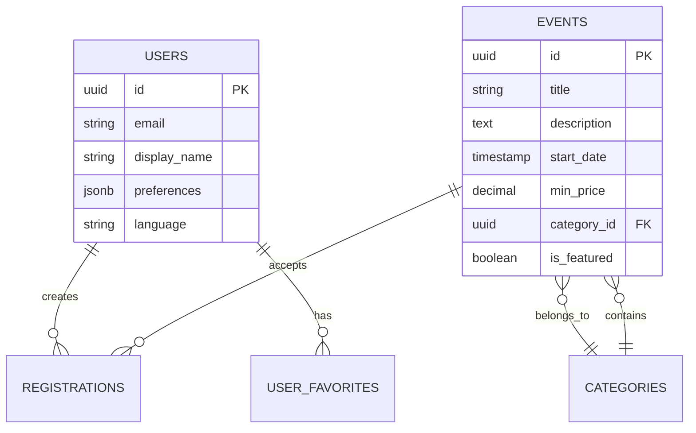

# FlutterFlow 事件平台：資料庫架構設計

> **專案類型：** Brownfield 整合  
> **架構版本：** 1.0  
> **建立日期：** 2025-01-15  

---

## 📋 目錄

- [1. 核心資料庫架構](#1-核心資料庫架構)
- [2. 關鍵資料表設計](#2-關鍵資料表設計)
- [3. 效能最佳化索引](#3-效能最佳化索引)
- [4. 國際化設計](#4-國際化設計)

---

## 1. 核心資料庫架構

### 1.1 實體關係概覽



### 1.2 架構設計原則

**核心設計策略：**
- **View-First Design**: 複雜查詢抽象化為效能視圖
- **JSONB Fields**: 彈性資料（偏好設定、中繼資料）使用 JSON
- **RLS Security**: Row Level Security 保護多租戶資料
- **Audit Trail**: 完整的時間戳記追蹤

---

## 2. 關鍵資料表設計

### 2.1 核心資料表

**✅ 生產就緒的資料表結構：**

```sql
-- 用戶表（增強版）
CREATE TABLE users (
    id UUID PRIMARY KEY DEFAULT gen_random_uuid(),
    email VARCHAR(255) UNIQUE NOT NULL,
    display_name VARCHAR(100),
    avatar_url TEXT,
    birthday DATE,
    location VARCHAR(100),
    preferences JSONB DEFAULT '{}',
    language VARCHAR(10) DEFAULT 'zh-TW',
    created_at TIMESTAMP DEFAULT NOW(),
    updated_at TIMESTAMP DEFAULT NOW()
);

-- 事件表
CREATE TABLE events (
    id UUID PRIMARY KEY DEFAULT gen_random_uuid(),
    title VARCHAR(255) NOT NULL,
    description TEXT,
    start_date TIMESTAMP NOT NULL,
    end_date TIMESTAMP,
    min_price DECIMAL(10,2) DEFAULT 0,
    max_price DECIMAL(10,2),
    image_url TEXT,
    venue_name VARCHAR(255),
    city VARCHAR(100),
    category_id UUID REFERENCES categories(id),
    is_featured BOOLEAN DEFAULT FALSE,
    status VARCHAR(20) DEFAULT 'published',
    created_at TIMESTAMP DEFAULT NOW(),
    updated_at TIMESTAMP DEFAULT NOW()
);

-- 分類表（增強版）
CREATE TABLE categories (
    id UUID PRIMARY KEY DEFAULT gen_random_uuid(),
    name VARCHAR(100) NOT NULL,
    name_en VARCHAR(100),
    event_count INTEGER DEFAULT 0,
    is_active BOOLEAN DEFAULT TRUE,
    sort_order INTEGER DEFAULT 0,
    created_at TIMESTAMP DEFAULT NOW()
);
```

### 2.2 關聯資料表

```sql
-- 報名記錄
CREATE TABLE registrations (
    id UUID PRIMARY KEY DEFAULT gen_random_uuid(),
    user_id UUID REFERENCES users(id),
    event_id UUID REFERENCES events(id),
    ticket_type VARCHAR(50),
    quantity INTEGER DEFAULT 1,
    payment_amount DECIMAL(10,2),
    payment_status VARCHAR(20) DEFAULT 'pending',
    status VARCHAR(20) DEFAULT 'registered',
    created_at TIMESTAMP DEFAULT NOW()
);

-- 用戶收藏
CREATE TABLE user_favorites (
    id UUID PRIMARY KEY DEFAULT gen_random_uuid(),
    user_id UUID REFERENCES users(id),
    event_id UUID REFERENCES events(id),
    created_at TIMESTAMP DEFAULT NOW(),
    UNIQUE(user_id, event_id)
);

-- 用戶活動記錄
CREATE TABLE user_activities (
    id UUID PRIMARY KEY DEFAULT gen_random_uuid(),
    user_id UUID REFERENCES users(id),
    activity_type VARCHAR(50),
    target_id UUID,
    metadata JSONB,
    created_at TIMESTAMP DEFAULT NOW()
);
```

### 2.3 高效能視圖

**主要事件列表視圖：**
```sql
CREATE VIEW v_events_list AS
SELECT 
    e.id,
    e.title,
    SUBSTRING(e.description, 1, 200) as description,
    e.start_date,
    e.min_price,
    e.max_price,
    e.image_url,
    e.venue_name,
    e.city,
    c.name as category_name,
    e.is_featured,
    -- 計算欄位
    CASE 
        WHEN e.min_price = 0 THEN 'Free'
        WHEN e.min_price = e.max_price THEN '$' || e.min_price
        ELSE '$' || e.min_price || ' - $' || e.max_price
    END as price_display
FROM events e
JOIN categories c ON e.category_id = c.id
WHERE e.status = 'published'
AND e.start_date > NOW()
ORDER BY e.is_featured DESC, e.start_date ASC;
```

**我的票券視圖：**
```sql
CREATE VIEW v_my_events AS
SELECT 
    r.id as registration_id,
    r.user_id,
    e.id as event_id,
    e.title,
    e.description,
    e.start_date,
    e.image_url,
    e.venue_name,
    e.city,
    c.name as category_name,
    r.ticket_type,
    r.quantity,
    r.payment_amount,
    r.payment_status,
    r.status as registration_status
FROM registrations r
JOIN events e ON r.event_id = e.id
JOIN categories c ON e.category_id = c.id
WHERE r.status != 'cancelled';
```

---

## 3. 效能最佳化索引

### 3.1 搜尋最佳化

**全文檢索索引：**
```sql
-- 多語言搜尋支援
CREATE INDEX idx_events_search_en ON events 
USING gin(to_tsvector('english', title || ' ' || description));

CREATE INDEX idx_events_search_zh ON events 
USING gin(to_tsvector('simple', title || ' ' || description));
```

### 3.2 查詢最佳化索引

**核心效能索引：**
```sql
-- 事件主要查詢索引
CREATE INDEX idx_events_start_date ON events(start_date);
CREATE INDEX idx_events_category_date ON events(category_id, start_date);
CREATE INDEX idx_events_featured_date ON events(is_featured, start_date);

-- 用戶相關索引
CREATE INDEX idx_registrations_user_id ON registrations(user_id);
CREATE INDEX idx_user_favorites_user_event ON user_favorites(user_id, event_id);
CREATE INDEX idx_user_activities_user_type ON user_activities(user_id, activity_type);

-- 搜尋相關複合索引
CREATE INDEX idx_events_status_date ON events(status, start_date) 
WHERE status = 'published';
```

---

## 4. 國際化設計

### 4.1 動態常數系統

**資料庫驅動的 FFAppConstants 替代：**
```sql
-- 應用程式常數表
CREATE TABLE app_constants (
    id UUID PRIMARY KEY DEFAULT gen_random_uuid(),
    constant_type VARCHAR(50) NOT NULL,  -- 'interests', 'sort_options', etc.
    constant_key VARCHAR(100) NOT NULL,
    display_order INTEGER DEFAULT 0,
    created_at TIMESTAMP DEFAULT NOW()
);

-- 多語言翻譯表
CREATE TABLE app_constant_translations (
    id UUID PRIMARY KEY DEFAULT gen_random_uuid(),
    constant_id UUID REFERENCES app_constants(id),
    language_code VARCHAR(10) NOT NULL,
    display_text TEXT NOT NULL,
    created_at TIMESTAMP DEFAULT NOW(),
    UNIQUE(constant_id, language_code)
);
```

### 4.2 多語言查詢函數

**最佳化的本地化查詢：**
```sql
CREATE OR REPLACE FUNCTION get_localized_constants(
    p_constant_type VARCHAR(50),
    p_language_code VARCHAR(10) DEFAULT 'zh-TW'
)
RETURNS TABLE(display_text TEXT) AS $$
BEGIN
    RETURN QUERY
    SELECT act.display_text
    FROM app_constants ac
    JOIN app_constant_translations act ON ac.id = act.constant_id
    WHERE ac.constant_type = p_constant_type
    AND act.language_code = p_language_code
    ORDER BY ac.display_order;
END;
$$ LANGUAGE plpgsql;
```

### 4.3 內容本地化

**多語言內容策略：**
```sql
-- 事件內容本地化（選用）
ALTER TABLE events ADD COLUMN title_en TEXT;
ALTER TABLE events ADD COLUMN description_en TEXT;

-- 分類本地化（已實作）
ALTER TABLE categories ADD COLUMN name_en VARCHAR(100);
```

---

## 📊 資料庫狀態總覽

### 4.4 實作狀態

**✅ 完成的組件：**
- 所有核心資料表和關聯表
- 效能最佳化視圖 (v_events_list, v_my_events)
- 使用者增強功能 (收藏、活動記錄)
- RLS 安全性政策
- 基礎索引結構

**🔄 待完成組件：**
- 多語言常數資料初始化
- 全文檢索索引建立
- 進階搜尋 RPC 函數實作

### 4.5 效能基準

**資料庫效能目標：**
- 查詢響應時間 95% < 100ms
- 搜尋查詢響應時間 < 300ms  
- 資料庫連接池使用率 < 70%
- 快取命中率 > 95%

這個資料庫架構為 Event Platform 提供了穩定、可擴展和高效能的資料基礎設施。